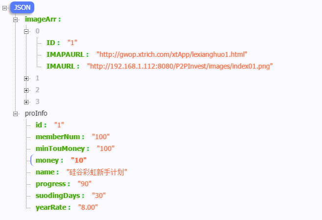

[TOC]
- - -
## 0.HomeFragment处理未捕获异常


---

## 1.HomeFragment页面布局--初步


---

## 2.HomeFragment初始化数据--联网操作
### 2.1 使用联网框架 app/libs/android-async-http-master.jar
### 2.2 使用框架获取json数据

```

    /**
     * 初始化数据:联网获取数据
     * 1. 使用 android-async-http-master.jar 框架联网
     * 2. 使用app/libs/fastjson-1.2.4.jar 框架解析json数据
     */
    private void initData() {
        String url = AppNetConfig.INDEX; //首页面url

        Log.d("HomeFragment", url);
        AsyncHttpClient client = new AsyncHttpClient();
        client.post(url, new AsyncHttpResponseHandler() {
            @Override
            public void onSuccess(String content) {
                //解析请求到的json格式数据
                parseJsonWithFJ(content);
            }

            @Override
            public void onFailure(Throwable error, String content) {
                Toast.makeText(getContext(), "联网失败:" + error.getMessage(), Toast.LENGTH_SHORT).show();
            }
        });
    }
```

### 2.3 使用框架解析json数据
>app/libs/fastjson-1.2.4.jar

数据格式:

```
{ "imageArr": [ { "ID": "1", "IMAPAURL": "http://gwop.xtrich.com/xtApp/lexianghuo1.html", "IMAURL": "http://192.168.191.1:8080/P2PInvest/images/index01.png" }, { "ID": "2", "IMAPAURL": "http://gwop.xtrich.com/xtApp/new-plan.html", "IMAURL": "http://192.168.191.1:8080/P2PInvest/images/index02.png" }, { "ID": "3", "IMAPAURL": "http://gwop.xtrich.com/xtApp/new-plan.html", "IMAURL": "http://192.168.191.1:8080/P2PInvest/images/index03.png" }, { "ID": "5", "IMAPAURL": "http://gwop.xtrich.com/xtApp/twcx.html", "IMAURL": "http://192.168.191.1:8080/P2PInvest/images/index04.png" } ], "proInfo": { "id": "1", "memberNum": "100", "minTouMoney": "100", "money": "10", "name": "硅谷彩虹新手计划", "progress": "90", "suodingDays": "30", "yearRate": "8.00" } }
```

#### 2.3.1创建json数据对应的bean对象

```
public class IndexImage {

        public  String ID;
        public String IMAPAURL;
        public String IMAURL;
}
```


```
public class IndexJson {
    public IndexProInfo proInfo ;
    public List<IndexImage> imageArr;
    }
```


```
public class IndexProInfo {

    public String id;
    public String memberNum;
    public String minTouMoney;
    public String money;
    public String name;
    public String progress;
    public String suodingDays;
    public String yearRate;
}
```

#### 2.3.2解析数据到bean对象
>使用框架:app/libs/fastjson-1.2.4.jar

```
private IndexJson indexJson;

    private void parseJsonWithFJ(String content) {
        //创建bean对象
        indexJson = new IndexJson();

        JSONObject jsonObject = JSON.parseObject(content);
        String strProInfo = jsonObject.getString("proInfo");
        //1. 解析proinfo 对象
        IndexProInfo proInfo = JSON.parseObject(strProInfo, IndexProInfo.class);

        //2. 解析image数组
        String strImageArr = jsonObject.getString("imageArr");
        List<IndexImage> imageArr = JSON.parseArray(strImageArr, IndexImage.class);

        //3. 封装到indexbean对象中
        indexJson.proInfo = proInfo;
        indexJson.imageArr = imageArr;

        //4. 更新页面数据
        tvHomeFragmentProduct.setText(indexJson.proInfo.name);
        tvFragmentHomeYearrate.setText(indexJson.proInfo.yearRate+"%");
    }
```


#### 2.3.3 显示网络数据效果


---

## 3 使用ViewPager显示图片
 

### 3.1 设置ViewPager 对象  
> 解析json数据后设置viewpager

```java

    private void parseJsonWithFJ(String content) {
        //创建bean对象
        indexJson = new IndexJson();

        JSONObject jsonObject = JSON.parseObject(content);
        String strProInfo = jsonObject.getString("proInfo");
        //1. 解析proinfo 对象
        IndexProInfo proInfo = JSON.parseObject(strProInfo, IndexProInfo.class);

        //2. 解析image数组
        String strImageArr = jsonObject.getString("imageArr");
        List<IndexImage> imageArr = JSON.parseArray(strImageArr, IndexImage.class);

        //3. 封装到indexbean对象中
        indexJson.proInfo = proInfo;
        indexJson.imageArr = imageArr;

        //4. 更新页面数据
        tvHomeFragmentProduct.setText(indexJson.proInfo.name);
        tvFragmentHomeYearrate.setText(indexJson.proInfo.yearRate + "%");


        //5. 设置viewpager
        vpFragmentHome.setAdapter(new ViewPagerAdapter());

    }
```


### 3.2 创建Adapter类--ViewPagerAdapter

```java
    /**
     * viewpager Adapter
     */
    private class ViewPagerAdapter extends PagerAdapter {
        @Override
        public int getCount() {
            return indexJson.imageArr.size()==0?0:indexJson.imageArr.size();
        }

        @Override
        public boolean isViewFromObject(View view, Object object) {
            return view ==object;
        }

        @Override
        public Object instantiateItem(ViewGroup container, int position) {
            //1. 实例化imageview
            ImageView imageView = new ImageView(getActivity());
            imageView.setScaleType(ImageView.ScaleType.CENTER_CROP);//设置图片剧中显示
            IndexImage  indexImage= indexJson.imageArr.get(position);
            String imgurl = indexImage.IMAURL;  //获取图片地址
            //2) 使用picasso 根据url获取图片
            Picasso.with(getContext())
                    .load(imgurl)
                    .into(imageView);
            //2. 将imageview 添加到container中
            container.addView(imageView);
            return  imageView;
        }

        @Override
        public void destroyItem(ViewGroup container, int position, Object object) {

        }
    }
```

### 3.3 使用Picasso加载网络图片
> ViewPagerAdapter > instantiateItem 中实例化ImageView

```java
        @Override
        public Object instantiateItem(ViewGroup container, int position) {
            //1. 实例化imageview
            ImageView imageView = new ImageView(getActivity());
            imageView.setScaleType(ImageView.ScaleType.CENTER_CROP);//设置图片剧中显示
            IndexImage  indexImage= indexJson.imageArr.get(position);
            String imgurl = indexImage.IMAURL;  //获取图片地址
            //2) 使用picasso 根据url获取图片
            Picasso.with(getContext())
                    .load(imgurl)
                    .into(imageView);
            //2. 将imageview 添加到container中
            container.addView(imageView);
            return  imageView;
        }

```


> 使用Picasso
>     compile 'com.squareup.picasso:picasso:2.5.2'

```
            Picasso.with(getContext())
                    .load(imgurl)
                    .into(imageView);
```

---

## 4 修饰viewpager 小圆点
>使用第三方框架:ViewPagerIndicatorlibrary
https://github.com/JakeWharton/ViewPagerIndicator

### 4.1 加载ViewPagerIndicatorlibrary
> 以第三方library 方式加载框架
 

### 4.2 修改布局文件
>layout/fragment_home.xml

```
<!--                <TextView
                    android:layout_marginBottom="5dp"
                    android:text="小圆点"
                    android:layout_gravity="center|bottom"
                    android:layout_width="wrap_content"
                    android:layout_height="wrap_content" />
    -->
                <com.viewpagerindicator.CirclePageIndicator
                    android:id="@+id/vpi_home_indicator"
                    android:layout_width="match_parent"
                    android:layout_height="wrap_content"
                    android:layout_gravity="center_horizontal|bottom"
                    android:layout_marginBottom="5dp"
                    />
```

### 4.3 修改布局文件
>设置viewpagerindicator

```
        //5. 设置viewpager
        vpFragmentHome.setAdapter(new ViewPagerAdapter());

        //6. 设置viewpagerindicator

        vpiHomeIndicator.setViewPager(vpFragmentHome);
```


### 4.4 效果图

 

---
## 5 修饰viewpager 小圆点2
>使用Banner https://github.com/youth5201314/banner

>效果:

 


### Step 1.依赖banner
Gradle
```
dependencies{
    compile 'com.youth.banner:banner:1.4.9'  //最新版本
}
```


### Step 2.添加权限到你的 AndroidManifest.xml

```


<!-- if you want to load images from the internet -->
<uses-permission android:name="android.permission.INTERNET" /> 

<!-- if you want to load images from a file OR from the internet -->
<uses-permission android:name="android.permission.READ_EXTERNAL_STORAGE" />

```

### Step 3.在布局文件中添加Banner，可以设置自定义属性

！！！此步骤可以省略，直接在Activity或者Fragment中new Banner();

```
                <com.youth.banner.Banner
                    android:id="@+id/banner"
                    android:layout_width="match_parent"
                    android:layout_height="match_parent" />
```

#### Step 4.解析json数据后设置banner
> 在Activity或者Fragment中配置Banner
> setBanner(int mode)

```
    /**
     * 设置banner
     *  mode: 1--简易显示 2 --详细显示
     */
    private void setBanner(int mode) {
        //设置banner样式
        banner.setBannerStyle(BannerConfig.CIRCLE_INDICATOR_TITLE);
        //设置图片加载器
        banner.setImageLoader(new GlideImageLoader());

        //设置图片地址集合
        List<String> imagesUrl = new ArrayList<String>(indexJson.imageArr.size());
        for (int i=0;i<indexJson.imageArr.size();i++){
            imagesUrl.add(indexJson.imageArr.get(i).IMAURL);
        }

        switch (mode){
            case 1: //1. 简单轮番
                banner.setImages(imagesUrl)
                        .setImageLoader(new GlideImageLoader())
                        .start();
                    break;
            case 2: //2. 详细轮番
                String titles[] = new String[]{"分享砍学费","人脉总动员","想不到你是这样的app","购物节，爱不单行"};
                banner.setImages(imagesUrl)                             //设置图片(集合)
                        .setBannerAnimation(Transformer.DepthPage)      //设置动画
                        .setBannerTitles(Arrays.asList(titles))         //设置标题
                        .isAutoPlay(true)                               //设置自动轮播，默认为true
                        .setDelayTime(1500)                             //设置轮播时间
                        .setBannerStyle(BannerConfig.CIRCLE_INDICATOR_TITLE_INSIDE)
                        .setIndicatorGravity(BannerConfig.CENTER)       //设置指示器位置（当banner模式中有指示器时）
                        .start();                                       //banner设置方法全部调用完毕时最后调用
                    break;
        }
    }

```


### Step 5.重写图片加载器

```
    /**
     * 使用banner:重写图片加载器
     */
    public class GlideImageLoader extends ImageLoader {
        @Override
        public void displayImage(Context context, Object path, ImageView imageView) {
            /**
             注意：
             1.图片加载器由自己选择，这里不限制，只是提供几种使用方法
             2.返回的图片路径为Object类型，由于不能确定你到底使用的那种图片加载器，
             传输的到的是什么格式，那么这种就使用Object接收和返回，你只需要强转成你传输的类型就行，
             切记不要胡乱强转！
             */

            //Picasso 加载图片简单用法
            Picasso.with(context).load((String) path).into(imageView);
        }
    }
```


### Step 6.（可选）增加体验

```
//如果你需要考虑更好的体验，可以这么操作
@Override
protected void onStart() {
    super.onStart();
    //开始轮播
    banner.startAutoPlay();
}

@Override
protected void onStop() {
    super.onStop();
    //结束轮播
    banner.stopAutoPlay();
}
```