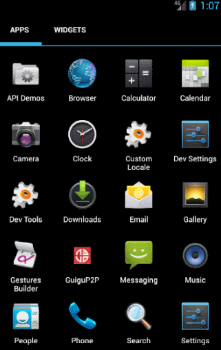

[TOC]  
- - -
## 0 欢迎界面效果



## 1 设置启动动画
> onCreate() 中设置动画
> 注意: 动画结束后启动首页(两种方式)

`setAnimation();` 


```
    /**
     * 3. 设置启动界面动画
     */
    private void setAnimation() {
        //1. 设置透明动画
        AlphaAnimation animation = new AlphaAnimation(0, 1);//透明度0-1
        animation.setDuration(2000);
        animation.setInterpolator(new AccelerateInterpolator());//设置变化率

        //结束动画后跳转页面
        //方式一: 动画监听
        animation.setAnimationListener(new Animation.AnimationListener() {
            @Override
            public void onAnimationStart(Animation animation) {

            }

            @Override
            public void onAnimationEnd(Animation animation) {
                startMainActivity();
            }

            @Override
            public void onAnimationRepeat(Animation animation) {

            }
        });
        //方式二: handler延时消息
        handler.postDelayed(new Runnable() {
            @Override
            public void run() {
                startMainActivity();
            }
        },2000);

        //启动动画
        rlWelcome.startAnimation(animation);
    }


```


## 2 启动首页面
### 方式一: 动画监听

```
        animation.setAnimationListener(new Animation.AnimationListener() {
            @Override
            public void onAnimationStart(Animation animation) {

            }

            @Override
            public void onAnimationEnd(Animation animation) {
                startMainActivity();
            }

            @Override
            public void onAnimationRepeat(Animation animation) {

            }
        });
```

### 方式二 :handler延时消息

```
        handler.postDelayed(new Runnable() {
            @Override
            public void run() {
                startMainActivity();
            }
        },2000);
```
