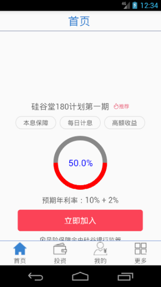
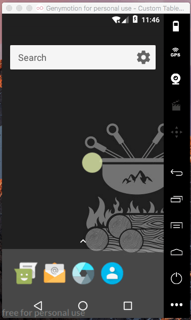

[TOC]

# 圆形进度条

## 1.绘制圆环
>效果: 



### (1) 创建自定义圆环对应的类

```java
package com.example.chen.guigup2p.ui;

import android.content.Context;
import android.graphics.Canvas;
import android.graphics.Color;
import android.graphics.Paint;
import android.graphics.Rect;
import android.graphics.RectF;
import android.support.annotation.Nullable;
import android.util.AttributeSet;
import android.view.View;

import com.example.chen.guigup2p.util.UIUtils;

/**
 * 自定义圆形进度条
 * 1. 创建画布
 * 2. 初始化画笔
 * 3. 获取视图宽高-> 圆环半径/宽度/圆心-> 绘制圆环
 *
 */

public class RoundProgress extends View {
 /*   public RoundProgress(Context context) {
        super(context);
    }

    public RoundProgress(Context context, @Nullable AttributeSet attrs) {
        super(context, attrs);
    }

    public RoundProgress(Context context, @Nullable AttributeSet attrs, int defStyleAttr) {
        super(context, attrs, defStyleAttr);
    }
*/

    private Paint paint ;
    private int roundColor = Color.GRAY;
    private int ProgressColor = Color.RED;
    private int textColor = Color.BLUE;


    private int textSize = UIUtils.px2dp(80);//文字大小 使用px->dp
    private int roundWidth = UIUtils.px2dp(40); //圆环宽度 10px->dp

    //进度大小
    private float roundMax = 100;
    private float roundProgress = 50;

    private int with ;//当前视图的宽度(高度)


    public RoundProgress(Context context) {
         this(context,null);
     }

    public RoundProgress(Context context, @Nullable AttributeSet attrs) {
        this(context, attrs,0);
    }

    public RoundProgress(Context context, @Nullable AttributeSet attrs, int defStyleAttr) {
        super(context, attrs, defStyleAttr);

        paint = new Paint();
        paint.setAntiAlias(true);//pain 去除锯齿
    }


    //测量视图
    @Override
    protected void onMeasure(int widthMeasureSpec, int heightMeasureSpec) {
        super.onMeasure(widthMeasureSpec, heightMeasureSpec);
        with = this.getMeasuredWidth();
    }


    //创建画布 绘制圆环
    @Override
    protected void onDraw(Canvas canvas) {
        //1. 获取圆心坐标 圆环半径 圆环宽度-->绘制圆环
        int cx = with/2;
        int cy = with/2;

        int radios = with/2 - roundWidth/2; //圆环中心半径


        paint.setColor(roundColor);
        paint.setStyle(Paint.Style.STROKE);//描边FILL(填充)  STROKE(描边) FILL_AND_STROKE(填充+描边)

        paint.setStrokeWidth(roundWidth);
        canvas.drawCircle(cx,cy,radios,paint);


        //2.绘制圆环

        RectF oval = new RectF(roundWidth/2, roundWidth/2,with-roundWidth/2,with-roundWidth/2);//圆弧的外切矩形

        float startAngle = 0;
        float sweepAngle = roundProgress/roundMax *360;

        paint.setColor(ProgressColor);
        canvas.drawArc(oval,startAngle,sweepAngle,false,paint);


        //3. 绘制文字


        String text = roundProgress+"%";

        paint.setStrokeWidth(0);
        paint.setTextSize(textSize);
        paint.setColor(textColor);

        Rect rectText = new Rect();

        paint.getTextBounds(text,0,text.length(),rectText); //使用矩形框包裹文本，获取矩形框的宽高


        //文本区域的左下角
        int textX = cx-rectText.width()/2;
        int textY = cy+rectText.height()/2;
        canvas.drawText(text,textX,textY,paint);

    }
}

```


### (2) 修改布局文件: 使用自定义的 视图对象

```xml
<!--

            <Button
                android:layout_width="120dp"
                android:layout_height="120dp"
                android:layout_marginTop="10dp"
                android:text="我是圆形进度条" />
-->

            <com.example.chen.guigup2p.ui.RoundProgress
                android:layout_width="120dp"
                android:layout_height="120dp"
                android:layout_marginTop="10dp"
                android:text="我是圆形进度条" />
```


---
## 2. 为自定义视图(圆环)添加自定义属性

>效果图:  


#### 2.1 说明
##### 1. 什么是自定义属性？
    定义可以在布局文件的标签中使用的属性。
##### 2. 为什么要自定义视图属性?
    这样就可以通过布局的方式给视图对象指定特定的属性值, 而不用动态的设置
#####  3.理解属性值的类型(format)
 1. reference 引用类型值 :@id/...
 2. color 颜色类型值  #ff00ff
 3. boolean 布尔类型值 true false
 4. dimension 尺寸类型值 dp / px /sp
 5. integer 整数类型值  weight  progress max
 6. float 小数类型值  0.5f
 7. string 字符串类型值  ""
 8. <enum> 枚举类型值 ：水平/垂直

#### 2.2 具体步骤
##### 1) 定义属性: 在values目录下创建attrs.xml values/attrs.xml

```xml
<?xml version="1.0" encoding="utf-8"?>
<resources>
<!--使用自定义属性-->
 <declare-styleable name="RoundProgress">
     <attr name="roundColor" format="color" ></attr>
     <attr name="ProgressColor" format="color" ></attr>
     <attr name="textColor" format="color" ></attr>

     <attr name="textSize" format="dimension" ></attr>
     <attr name="roundWidth" format="dimension" ></attr>
     <attr name="roundMax"  format="float"></attr>
     <attr name="roundProgress"  format="float"></attr>

 </declare-styleable>
</resources>
```

##### 2) 在布局文件中引用当前应用的名称空间
```xml
    xmlns:atguigu="http://schemas.android.com/apk/res-auto"
```

##### 3) 自定义视图标签<<> 中使用自定义属性

```xml
            <!--使用自定义属性-->
            <com.example.chen.guigup2p.ui.RoundProgress
                android:layout_width="120dp"
                android:layout_height="120dp"
                android:layout_marginTop="10dp"
                android:text="我是圆形进度条"

                atguigu:roundColor="@android:color/holo_blue_light"
                atguigu:ProgressColor="@android:color/holo_green_light"
                atguigu:textColor="@android:color/holo_red_dark"

                atguigu:roundWidth="15dp"
                atguigu:textSize="20dp"
                atguigu:roundMax="100"
                atguigu:roundProgress="70"

                />
```

##### 4) 在自定义View类的构造方法中, 取出布局中的自定义属性值

```java

    public RoundProgress(Context context, @Nullable AttributeSet attrs, int defStyleAttr) {
        super(context, attrs, defStyleAttr);

        paint = new Paint();
        paint.setAntiAlias(true);//pain 去除锯齿


        /*提取自定义属性*/
        //1. 获取所有资源数据
        TypedArray typedArray = context.obtainStyledAttributes(attrs, R.styleable.RoundProgress);


        //2. 为资源数据赋值
        roundColor = typedArray.getColor(R.styleable.RoundProgress_roundColor, Color.GRAY);
        ProgressColor = typedArray.getColor(R.styleable.RoundProgress_ProgressColor,Color.RED);
        textColor = typedArray.getColor(R.styleable.RoundProgress_textColor,Color.BLUE);

        textSize = typedArray.getDimension(R.styleable.RoundProgress_textSize,40);
        roundWidth =  typedArray.getDimension(R.styleable.RoundProgress_roundWidth,40);

        roundMax = typedArray.getFloat(R.styleable.RoundProgress_roundMax,100);
        roundProgress = typedArray.getFloat(R.styleable.RoundProgress_roundProgress,0);

        //3.释放资源数据
        typedArray.recycle();
    }

```

## 3. 让圆环动起来
1. 创建分线程

>   com.example.chen.guigup2p.fragment.HomeFragment >  private void parseJsonWithFJ(String content) {...}

```java
        //启用分线程分段绘制圆环，使圆环动起来
        new Thread(runable).start();
```


2. 根据进度，分段设置圆环进度 强制重绘圆环
```java
    //让圆环动起来
    private int currenProgress;
    private Runnable runable = new Runnable() {
        @Override
        public void run() {
            diyRoundProgress.setRoundMax(100);

            for (int i=0;i<currenProgress;i++){
                diyRoundProgress.setRoundProgress(i+1);
                SystemClock.sleep(10);
                diyRoundProgress.postInvalidate();//强制重绘

            }
        }
    };

```


>注意：
diyRoundProgress.postInvalidate();//强制重绘--分线程主线程都可使用
diyRoundProgress.Invalidate();//强制重绘--只能在主线程使用

效果：

