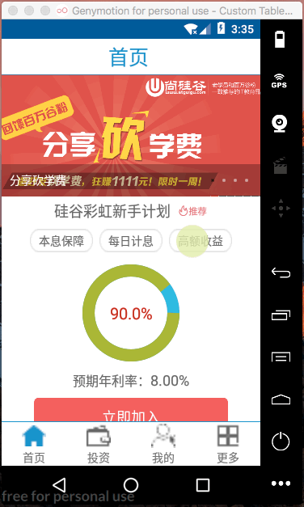

自定义scrollview
> com/example/chen/guigup2p/ui/MyScrollView.java

> 基本自定义scrollview功能实现

效果：
 


```java


/**
 * Created by chen on 2017/8/5.
 */

public class MyScrollView extends ScrollView {

    private View childview;

    public MyScrollView(Context context) {
        super(context);
    }

    public MyScrollView(Context context, AttributeSet attrs) {
        super(context, attrs);
    }

    public MyScrollView(Context context, AttributeSet attrs, int defStyleAttr) {
        super(context, attrs, defStyleAttr);
    }

    @Override
    protected void onFinishInflate() {
        super.onFinishInflate();
        if (getChildCount() > 0) {
            childview = getChildAt(0);
        }

    }


    private int lastY; //记录上一次y轴方向的距离
    private Rect normal = new Rect();//记录边界位置的childview 的坐标


    private  boolean isAnimationFinished = true; //动画结束后才能继续拖拽

    @Override
    public boolean onTouchEvent(MotionEvent ev) {
        if (childview == null&& !isAnimationFinished) {
            return super.onTouchEvent(ev);
        }

        int eventY = (int) ev.getY();//获取事件坐标

        switch (ev.getAction()) {
            case MotionEvent.ACTION_DOWN:
                lastY = eventY;
                break;

            case MotionEvent.ACTION_MOVE:
                Log.d("MyScrollView", "move");
                int dy = eventY - lastY; //计算微小的移动量

                if (isNeedMove()) {
                    if(normal.isEmpty()) {//记录临界位置的左上右下
                        normal.set(childview.getLeft(),childview.getTop(),childview.getRight(),childview.getBottom());
                    }
                    childview.layout(childview.getLeft(),childview.getTop()+dy/2,childview.getRight(),childview.getBottom()+dy/2);
                }

                lastY = eventY; //重新赋值
                break;


            case MotionEvent.ACTION_UP:
                if(isNeedAnimation()) {
                    Log.d("MyScrollView", "up");
                    //1. 使用平移动画 还原视图
                    int translateY = childview.getBottom()-normal.bottom;

                    TranslateAnimation translate = new TranslateAnimation(0,0,0,-translateY);
                    translate.setDuration(500);
                    translate.setAnimationListener(new Animation.AnimationListener() {
                        @Override
                        public void onAnimationStart(Animation animation) {
                            isAnimationFinished = false;

                        }

                        @Override
                        public void onAnimationEnd(Animation animation) {
                            isAnimationFinished = true;
                            childview.clearAnimation();
                            childview.layout(normal.left,normal.top,normal.right,normal.bottom);
                            normal.setEmpty();

                        }

                        @Override
                        public void onAnimationRepeat(Animation animation) {

                        }
                    });
                    childview.startAnimation(translate);
                }

                break;


        }


        return super.onTouchEvent(ev);

    }

    private boolean isNeedAnimation() {
        return  !normal.isEmpty();
    }

    /**
     * 判断scroll子视图的移动是否超出边界
     *
     * @return
     */
    private boolean isNeedMove() {
        int scrollY = this.getScrollY();//获取scroll的偏移量

        int childHight = childview.getMeasuredHeight();//获取子视图高度

        int dy = childHight - this.getMeasuredHeight();// dy = childhight - scrollHight

        if (scrollY <= 0 || scrollY >= dy) {//1. child向上移动超出边界  2. child 向下移动超出边界
            return true; // 超出边界 --使用自定义scroll方式处理
        }
        return false;// 使用默认scrollview 方式处理
    }
}

```


## 事件冲突与拦截

> 因为scrollview的触摸和viewpager 的触摸事件会存在冲突现象，需要添加事件拦截
思路：
1. 当dy > dx &&dy > Ymove  拦截
2. 否则不拦截


```java


    /**
     * 实现父视图对子视图的触摸事件的拦截
     * 拦截成功与否，通过返回值表示：ture 成功，flase :拦截失败
     *
     * @param ev
     * @return
     */


    private  int lastX,downX,downY;
    @Override
    public boolean onInterceptTouchEvent(MotionEvent ev) {
        ///return super.onInterceptTouchEvent(ev);

        boolean isIntercept = false;
        int eventX = (int) ev.getX();
        int eventY = (int) ev.getY();

        switch (ev.getAction()){
            case MotionEvent.ACTION_DOWN:
                lastX = downX  = eventX;
                lastY = downY = eventY;
                break;

            case MotionEvent.ACTION_MOVE:
                int dx = Math.abs(eventX -lastX);
                int dy = Math.abs(eventY - lastY);


                if(dy>dx&&dy>10) {
                    isIntercept = true;
                }

                lastY = eventY;
                lastX = eventX;
                break;
        }

        return  isIntercept;
    }

```


