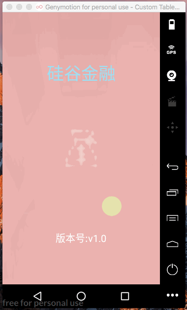

[TOC]

编写loadingpage

# 1. 流程分析

```
LoadingPage  --->FrameLayout

1.
state_loading = 1;
state_error = 2;
state_empty = 3;
state_success = 4;

state_current =  1;

2.提供4种不同界面：
正在加载中
加载失败
加载成功，但是数据为空
加载成功，且有数据

3.根据state_current的值，决定显示哪个界面。
（初始化时，应该显示：正在加载）

4.在类中，实现联网操作，根据联网的结果，修改state_current的值，决定显示哪个界面。

5.如果是state_current = 4,需要考虑如何将数据传递给具体的Fragment.

```


## 1.创建loadingpager.class 继承FrameLayout
0. 修改构造方法
1. 定义变量记录四中状态
2. 提供四中状态对应的视图
3. 初始化视图init（）


```java
/**
 * Created by chen on 2017/8/5.
 * 1. 记录四中不同显示状态
 * 2. 提供四中页面--对应四中显示状态
 */

public abstract class LoadingPager extends FrameLayout {


    //记录四中不同的显示状态
    private static final int STATE_LOADING = 1;
    private static final int STATE_ERR = 2;
    private static final int STATE_EMPTY = 3;
    private static final int STATE_SUCCESS = 4;

    //当前显示状态--根据联网结果而定
    private int state_current = STATE_LOADING; //默认情况下当前状态为正在加载


    //2. 提供四种不同显示界面
    private View view_loading;
    private View view_err;
    private View view_empty;
    private View view_success;


    private LayoutParams params; 


    public LoadingPager(@NonNull Context context) {
        this(context, null);
    }

    public LoadingPager(@NonNull Context context, @Nullable AttributeSet attrs) {
        this(context, attrs, 0);
    }

    public LoadingPager(@NonNull Context context, @Nullable AttributeSet attrs, @AttrRes int defStyleAttr) {
        super(context, attrs, defStyleAttr);
        init();//初始化视图界面方法
    }


    /**
     * 实例化view
     *
     * 1. 提供布局显示参数
     * 2. 加载视图
     * 3. 添加视图到布局中
     */
    private void init() {

        //使视图填充父视图
        params = new LayoutParams(ViewGroup.LayoutParams.MATCH_PARENT, ViewGroup.LayoutParams.MATCH_PARENT);

        if (view_loading == null) {
            //2. 加载布局
            view_loading = UIUtils.getView(R.layout.page_loading);
            //3. 添加到framelayout 中
            addView(view_loading, params);//调用framelayout 的addview方法

        }

        if (view_err == null) {
            view_err = UIUtils.getView(R.layout.page_error);
            addView(view_err, params);
        }
        if (view_empty == null) {
            view_empty = UIUtils.getView(R.layout.page_empty);
            addView(view_empty, params);

        }

        showSafePage();//保证其中的操作在主线程执行

    }

    /**
     * 保证主线程执行：更新界面
     */
    private void showSafePage() {
        UIUtils.runOnUiThread(new Runnable() {
            @Override
            public void run() {
                //保证run（） 方法在主线程执行
                showPage();
            }
        });
    }

    /**
     * 显示相应load界面:根据stata_current 决定要显示哪个页面
     */
    private void showPage() {
        view_loading.setVisibility(state_current==STATE_LOADING?View.VISIBLE:View.INVISIBLE);
        view_empty.setVisibility(state_current == STATE_EMPTY ? View.VISIBLE : View.INVISIBLE);
        view_err.setVisibility(state_current == STATE_ERR ? View.VISIBLE : View.INVISIBLE);

        if(view_success == null) {
            view_success = UIUtils.getView(layoutId()); //因为四个具体fragment返回的成功页面不一样，因此没法具体提供一个view
            addView(view_success,params);
        }


        view_success.setVisibility(state_current == STATE_SUCCESS ? View.VISIBLE : View.INVISIBLE);

    }

    public  abstract  int layoutId(); //使用抽象方法，为四个不同fragment提供各自的成功的返回页面

}

```

## 2.修改Uiutils 添加判断是当前进程是否为主进程
```java

    /**
     * 保证runnable操作在主线程执行
     * @param runnable
     */
    public static void runOnUiThread(Runnable runnable) {
        if(isMainThread()) {
            runnable.run();
        }else {
            UIUtils.getHandler().post(runnable);
        }
    }

    /**
     * 判断当前线程是否是主线程
     * @return
     */
    private static boolean isMainThread() {
        int currentTid = android.os.Process.myTid(); //当前线程ID
        int mainTid = MyApplication.mainThreadId; //主线程ID

        return  currentTid==mainTid;

    }

```

## 3.修改baseFragment

>将：

```java
    @Nullable
    @Override
    public View onCreateView(LayoutInflater inflater, @Nullable ViewGroup container, @Nullable Bundle savedInstanceState) {
     // View view = UIUtils.getView(getLayoutId());// 使用自定义UIUtils 工具类加载view视图
        View view = View.inflate(getContext(),getLayoutId(), null);
        ButterKnife.bind(this, view);

        initTitle();

        initData();
        return view;
    }
```

>修改为：

```java
    @Nullable
    @Override
    public View onCreateView(LayoutInflater inflater, @Nullable ViewGroup container, @Nullable Bundle savedInstanceState) {

        LoadingPager loadingPager = new LoadingPager(container.getContext()) {
            @Override
            public int layoutId() {
                return getLayoutId();
            }
        };
        return  loadingPager;
    }
```

> 效果
 

## 4.在类中，实现联网操作，根据联网的结果，修改state_current的值，决定显示哪个界面。

### 1.初步

>联网请求

```java
    /**
     * showe --根据联网请求结果， 确定要显示哪个loadingpage页面
     * 1. 使用异步联网请求
     */
     public void  show(){
         AsyncHttpClient client = new AsyncHttpClient();
         client.get(url(),params(),new AsyncHttpResponseHandler(){
             @Override
             public void onSuccess(String content) {
                 //1. 请求成功，内容为空
                 if(TextUtils.isEmpty(content)) { //content=null或者content=""
                     state_current = STATE_EMPTY;
                 }else {
                     //2. 请求成功，内容不为空
                     state_current = STATE_SUCCESS;
                 }
                 showSafePage();
             }
             @Override
             public void onFailure(Throwable error, String content) {
                 state_current = STATE_ERR;
                 showSafePage();// 保证在主线程中执行
             }
         });
     }
```

> 获取请求参数

```
    /**
     * 请求参数
     * @return
     */
    protected abstract RequestParams params();
```

> 获取请求地址

```
    /**
     * 请求地址
     * @return
     */
    protected abstract String url();

```


### 2.修改：封装请求结果（请求状态，响应内容）

> 使用枚举类封装请求响应 

```java

    /**
     * 使用枚举类型封装网络请求返回的（数据和状态）
     */
    public  enum  ResultState {

        //public  static final ResultState ERROR = new ResultState(2);

        ERROR(2),EMPTY(3),SUCCESS(4);
        int state;
        ResultState(int state) {
            this.state = state;
        }

        //封装联网响应
        private  String content;


        public int getState() {
            return state;
        }

        public void setState(int state) {
            this.state = state;
        }

        public String getContent() {
            return content;
        }

        public void setContent(String content) {
            this.content = content;
        }
    }
```


> 修改 show() 方法： 使用封装后的resultState 

```java
    private  ResultState resultState; //封装响应结果

    /**
     * showe --根据联网请求结果， 确定要显示哪个loadingpage页面
     * 1. 使用异步联网请求
     */
     public void  show(){
         AsyncHttpClient client = new AsyncHttpClient();
         client.get(url(),params(),new AsyncHttpResponseHandler(){
             @Override
             public void onSuccess(String content) {
                 //1. 请求成功，内容为空
                 if(TextUtils.isEmpty(content)) { //content=null或者content=""
//                     state_current = STATE_EMPTY;
                     resultState = ResultState.EMPTY;
                     resultState.setContent("");
                 }else {
                     //2. 请求成功，内容不为空
                     //state_current = STATE_SUCCESS;
                     resultState = ResultState.SUCCESS;
                     resultState.setContent(content);
                 }
                 //showSafePage();
                 loadImage();
             }
             @Override
             public void onFailure(Throwable error, String content) {
                 //state_current = STATE_ERR;
                 resultState = ResultState.ERROR;//使用枚举类
                 resultState.setContent("");
                 showSafePage();// 保证在主线程中执行
             }
         });

     }
```

> loadImage : 

```java
    /**
     * 更新state_current 的值
     *
     * 根据联网请求后的 > 枚举类的值resultState -> current_state
     */
    private void loadImage() {
        switch (resultState){
            case ERROR:
                state_current = STATE_ERR;
                break;
            case EMPTY:
                state_current = STATE_EMPTY;

                break;
            case SUCCESS:
                state_current = STATE_SUCCESS;
                break;
        }

        showSafePage();//根据修改后的state_current 的值， 更新视图显示
        //如果state_current = success
        // > 需要传出联网请求获取的数据 content
        // > 传出对应的视图view_success
        if(state_current==STATE_SUCCESS) {
            onSuccess(resultState,view_success);
        }
    }
```

> 请求响应成功切内容不为空执行以下操作：具体根据fragment而定
```java
    protected abstract void onSuccess(ResultState resultState, View view_success);
```

### 3.BaseFragment 修改

> onCreateView 中： 

```java
 /**
         * 使用loadingpage
         */

        LoadingPager loadingPager = new LoadingPager(container.getContext()) {
            @Override
            public int layoutId() {//确定loadingpage要显示的页面
                return getLayoutId();
            }
            //请求成功后执行操作：
            //1. 返回响应结果（封装在resultState中的content中）
            //2. 返回对应的要显示的视图（四个fragment对应）
            @Override
            protected void onSuccess(ResultState resultState, View view_success) {

                ButterKnife.bind(BaseFragment.this,view_success); //bind ButterKnife
                initTitle();//初始化标题
                initData(resultState.getContent()); //初始化数据
            }

            //联网请求参数
            @Override
            protected RequestParams params() {
                return getParams();
            }

            //联网请求地址--暴露到具体fragment实现
            @Override
            protected String url() {
                return getUrl();
            }
        };

        return  loadingPager;

    }

```


### 4.HomeFragment 联网获取数据

1. BaseFragment :调用loadingPager的联网操作
```java
    @Override
    public void onActivityCreated(@Nullable Bundle savedInstanceState) {
        super.onActivityCreated(savedInstanceState);
        loadingShowPage();//调用联网操作
    }

```

```java
    /**
     * 调用loadingPage 的show方法
     */
    public  void loadingShowPage(){ //在MainActivity中调用
        loadingPager.show();
    }
```


2. LoadingPage :调用show()方法执行联网操作:
   - 若不需要联网 URL==null 直接返回
   - 若需要联网 URL!=null 执行联网操作

```java
    /**
     * showe --根据联网请求结果， 确定要显示哪个loadingpage页面
     * 1. 使用异步联网请求
     */
     public void  show(){
         String url = url(); //获取联网操作的url
         //1. fragment 不需要联网
         if(TextUtils.isEmpty(url)) {
             //不需要联网
             resultState = ResultState.SUCCESS;
             resultState.setContent("");
             loadImage();
             return;
         }
         
/*
         UIUtils.getHandler().postDelayed(new Runnable() {
             @Override
             public void run() {
                 //若 模拟联网延时,将下列联网操作放到此处
             }
         }, 2000);
*/
         //2. fragment需要联网
         AsyncHttpClient client = new AsyncHttpClient();
         client.get(url(),params(),new AsyncHttpResponseHandler(){
             @Override
             public void onSuccess(String content) {
                 //1. 请求成功，内容为空
                 if(TextUtils.isEmpty(content)) { //content=null或者content=""
//                     state_current = STATE_EMPTY;
                     resultState = ResultState.EMPTY;
                     resultState.setContent("");
                 }else {
                     //2. 请求成功，内容不为空
                     //state_current = STATE_SUCCESS;
                     resultState = ResultState.SUCCESS;
                     resultState.setContent(content);
                 }
                 //showSafePage();
                 loadImage();
             }

             @Override
             public void onFailure(Throwable error, String content) {
                 //state_current = STATE_ERR;
                 resultState = ResultState.ERROR;//使用枚举类
                 resultState.setContent("");
                 //showSafePage();// 保证在主线程中执行
                 loadImage();
             }
         });
     }
```

效果:
 

