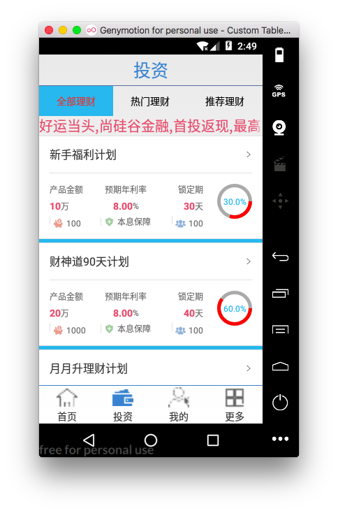
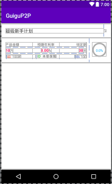
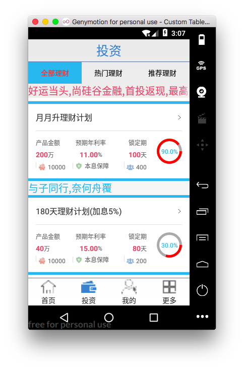

投资产品中的listview

[TOC]


# 1. 实现理财产品中全部理财产品的listview

> 效果

 

>步骤: 

①ListView 
②Item Layout 
③集合数据 (联网获取数据）
④BaseAdapter


## 1. 编写ListView 布局文件
> 全部理财产品界面布局 添加listview: layout/fragment_product_list.xml


```xml
//跑马灯
    <com.example.chen.guigup2p.ui.MarQuenTextView
        android:id="@+id/tv_product_list"
        android:textSize="20sp"
        android:text="好运当头,尚硅谷金融,首投返现,最高到1888元"
        android:textColor="@color/product_red_common"

        android:singleLine="true"
        android:ellipsize="marquee"
        android:layout_width="match_parent"
        android:layout_height="wrap_content" />

    <ListView
        android:id="@+id/lv_productlist"


        android:divider="@color/title_text"
        android:dividerHeight="5dp"
        android:layout_width="match_parent"
        android:layout_height="match_parent">

    </ListView>
```


## 2. 编写listview item 布局文件
```xml
<?xml version="1.0" encoding="utf-8"?>
<LinearLayout xmlns:android="http://schemas.android.com/apk/res/android"
    xmlns:app="http://schemas.android.com/apk/res-auto"
    android:layout_width="match_parent"
    android:layout_height="match_parent"
    android:background="@android:color/white"
    android:orientation="vertical">

    <View
        android:layout_width="match_parent"
        android:layout_height="1dp"
        android:background="@color/divider_line"/>

    <LinearLayout
        android:layout_width="match_parent"
        android:layout_height="wrap_content"
        android:gravity="center_vertical"
        android:orientation="vertical">

        <LinearLayout
            android:layout_width="match_parent"
            android:layout_height="wrap_content"
            android:orientation="horizontal"
            android:padding="15dp">

            <TextView
                android:id="@+id/p_name"
                android:layout_width="0dp"
                android:layout_height="wrap_content"
                android:layout_weight="1"
                android:text="超级新手计划"
                android:textColor="#333333"
                android:textSize="16sp"/>

            <ImageView
                android:layout_width="wrap_content"
                android:layout_height="wrap_content"
                android:layout_gravity="center_vertical"
                android:src="@drawable/right"/>
        </LinearLayout>

        <View
            android:layout_width="match_parent"
            android:layout_height="1dp"
            android:layout_marginLeft="15dp"
            android:layout_marginRight="15dp"
            android:background="@color/divider_line"/>
    </LinearLayout>


    <LinearLayout
        android:layout_width="match_parent"
        android:layout_height="wrap_content"
        android:orientation="horizontal"
        android:padding="15dp">


        <LinearLayout
            android:layout_width="0dp"
            android:layout_height="wrap_content"
            android:layout_weight="1"
            android:orientation="vertical">


            <LinearLayout
                android:layout_width="match_parent"
                android:layout_height="wrap_content"
                android:orientation="horizontal">

                <TextView
                    android:layout_width="0dp"
                    android:layout_height="wrap_content"
                    android:layout_weight="1"
                    android:gravity="left"
                    android:text="产品金额"
                    android:textColor="@color/product_detail_common"
                    android:textSize="12sp"/>

                <TextView
                    android:layout_width="0dp"
                    android:layout_height="wrap_content"
                    android:layout_weight="1"
                    android:gravity="center"
                    android:text="预期年利率"
                    android:textColor="@color/product_detail_common"
                    android:textSize="12sp"/>

                <TextView
                    android:layout_width="0dp"
                    android:layout_height="wrap_content"
                    android:layout_weight="1"
                    android:gravity="right"
                    android:text="锁定期"
                    android:textColor="@color/product_detail_common"
                    android:textSize="12sp"/>
            </LinearLayout>

            <LinearLayout
                android:layout_width="match_parent"
                android:layout_height="wrap_content"
                android:layout_marginTop="5dp"
                android:orientation="horizontal">


                <LinearLayout
                    android:layout_width="0dp"
                    android:layout_height="wrap_content"
                    android:layout_weight="1"
                    android:gravity="left">

                    <TextView
                        android:id="@+id/p_money"
                        android:layout_width="wrap_content"
                        android:layout_height="wrap_content"
                        android:text="10"
                        android:textColor="@color/product_red_common"
                        android:textSize="14sp"
                        android:textStyle="bold"/>

                    <TextView
                        android:layout_width="wrap_content"
                        android:layout_height="wrap_content"
                        android:text="万"
                        android:textColor="@color/product_detail_common"
                        android:textSize="12sp"/>
                </LinearLayout>

                <LinearLayout
                    android:layout_width="0dp"
                    android:layout_height="wrap_content"
                    android:layout_weight="1"
                    android:gravity="center">

                    <TextView
                        android:id="@+id/p_yearlv"
                        android:layout_width="wrap_content"
                        android:layout_height="wrap_content"
                        android:text="8.00"
                        android:textColor="@color/product_red_common"
                        android:textSize="14sp"
                        android:textStyle="bold"/>

                    <TextView
                        android:layout_width="wrap_content"
                        android:layout_height="wrap_content"
                        android:text="%"
                        android:textColor="@color/product_detail_common"
                        android:textSize="12sp"/>
                </LinearLayout>

                <LinearLayout
                    android:layout_width="0dp"
                    android:layout_height="wrap_content"
                    android:layout_weight="1"
                    android:gravity="right">

                    <TextView
                        android:id="@+id/p_suodingdays"
                        android:layout_width="wrap_content"
                        android:layout_height="wrap_content"
                        android:text="30"
                        android:textColor="@color/product_red_common"
                        android:textSize="14sp"
                        android:textStyle="bold"/>

                    <TextView
                        android:layout_width="wrap_content"
                        android:layout_height="wrap_content"
                        android:text="天"
                        android:textColor="@color/product_detail_common"
                        android:textSize="12sp"/>
                </LinearLayout>
            </LinearLayout>

            <LinearLayout
                android:layout_width="match_parent"
                android:layout_height="wrap_content"
                android:layout_marginTop="5dp"
                android:orientation="horizontal">

                <LinearLayout
                    android:layout_width="0dp"
                    android:layout_height="wrap_content"
                    android:layout_weight="1"
                    android:gravity="left">

                    <TextView
                        android:layout_width="1dp"
                        android:layout_height="12dp"
                        android:background="@color/divider_line"/>

                    <TextView
                        android:id="@+id/p_minzouzi"
                        android:layout_width="wrap_content"
                        android:layout_height="wrap_content"
                        android:layout_marginLeft="4dp"
                        android:drawableLeft="@drawable/manage_list_count"
                        android:drawablePadding="4dp"
                        android:text="100起"
                        android:textColor="@color/product_detail_common"
                        android:textSize="12sp"/>
                </LinearLayout>

                <LinearLayout
                    android:layout_width="0dp"
                    android:layout_height="wrap_content"
                    android:layout_weight="1"
                    android:gravity="center">

                    <TextView
                        android:layout_width="1dp"
                        android:layout_height="12dp"
                        android:background="@color/divider_line"/>

                    <TextView
                        android:layout_width="wrap_content"
                        android:layout_height="wrap_content"
                        android:layout_marginLeft="4dp"
                        android:drawableLeft="@drawable/manage_list_guarantee"
                        android:drawablePadding="4dp"
                        android:text="本息保障"
                        android:textColor="@color/product_detail_common"
                        android:textSize="12sp"/>
                </LinearLayout>

                <LinearLayout
                    android:layout_width="0dp"
                    android:layout_height="wrap_content"
                    android:layout_weight="1"
                    android:gravity="right">

                    <TextView
                        android:layout_width="1dp"
                        android:layout_height="12dp"
                        android:background="@color/divider_line"/>

                    <TextView
                        android:id="@+id/p_minnum"
                        android:layout_width="wrap_content"
                        android:layout_height="wrap_content"
                        android:layout_marginLeft="4dp"
                        android:drawableLeft="@drawable/manage_list_member"
                        android:drawablePadding="4dp"
                        android:text="100"
                        android:textColor="@color/product_detail_common"
                        android:textSize="12sp"/>
                </LinearLayout>
            </LinearLayout>
        </LinearLayout>

        <com.example.chen.guigup2p.ui.RoundProgress
            android:id="@+id/p_progresss"
            android:layout_width="50dp"
            android:layout_height="50dp"
            android:layout_marginLeft="20dp"

            app:roundColor="@android:color/darker_gray"
            app:roundWidth="5dp"
            app:textColor="#18b4ed"
            app:textSize="12sp">

        </com.example.chen.guigup2p.ui.RoundProgress>


    </LinearLayout>

    <View
        android:layout_width="match_parent"
        android:layout_height="1dp"
        android:background="@color/divider_line"/>
</LinearLayout>
```

> item 布局文件效果
 

## 3. 理财产品数据(联网获取)
> ProductListFragment.java  中的initDate() 获取联网数据 

```java

    @Override
    protected void initData(String content) {
      
        //3. 解析联网请求的数据

        JSONObject jsonObject = JSON.parseObject(content);

        Boolean success = jsonObject.getBoolean("success");

        if(success) {//获取数据成功
            String data = jsonObject.getString("data");
            productslist = JSON.parseArray(data,Product.class);
            //为listvie 设置adapter
            lv_productlist.setAdapter(new ProductAdapter(productslist));
        }
    }

```


## 4. 创建Adapter
> 理财产品listview 的适配器


```java
public class ProductAdapter extends BaseAdapter {
    private List<Product> productList;


    public ProductAdapter(List<Product> productList) {
        this.productList =productList;
    }

    @Override
    public int getCount() {
        return productList==null?0:productList.size();
    }

    @Override
    public Object getItem(int i) {
        return productList.get(i);
    }


    /**
     * 加载不同类型的item
     * 重写两个方法:
     *  getViewTypeCount()
     *   getItemViewType
     * @return
     */
    @Override
    public int getViewTypeCount() {
        return 2;
    }

    /**
     * 当item 的position是3 时 ,返回另一种类型的item视图 (textView)
     * @param position
     * @return
     */
    @Override
    public int getItemViewType(int position) {

        if(position == 3) {
            return 1;
        }else {
            return 0;
        }
    }

    @Override
    public long getItemId(int i) {
        return i;
    }

    @Override
    public View getView(int i, View view, ViewGroup viewGroup) {
        ViewHolder viewHolder ;


        //1. 获取view
        if(view==null) {
            view = View.inflate(viewGroup.getContext(),R.layout.item_product_list,null);

            viewHolder = new ViewHolder(view);
            view.setTag(viewHolder);

        }else {
           viewHolder = (ViewHolder) view.getTag();
        }

        int itemViewType = getItemViewType(i);


        if(itemViewType ==1) {

            TextView tv = new TextView(viewGroup.getContext());
            tv.setText("与子同行,奈何舟覆");
            tv.setTextSize(UIUtils.dp2px(20));
            tv.setTextColor(UIUtils.getColor(R.color.title_text));

            return tv;

        }

        if(i>3) {
            i--;
        }
        

        //2. 装配数据
        Product product = productList.get(i);

        viewHolder.pMinnum.setText(product.memberNum);
        viewHolder.pMinzouzi.setText(product.minTouMoney);
        viewHolder.pMoney.setText(product.money);
        viewHolder.pName.setText(product.name);

        float roundProgress = Float.parseFloat(product.progress);
        viewHolder.pProgresss.setRoundProgress(roundProgress);
        viewHolder.pSuodingdays.setText(product.suodingDays);
        viewHolder.pYearlv.setText(product.yearRate);

        return view;
    }


    static class ViewHolder {
        @Bind(R.id.p_name)
        TextView pName;
        @Bind(R.id.p_money)
        TextView pMoney;
        @Bind(R.id.p_yearlv)
        TextView pYearlv;
        @Bind(R.id.p_suodingdays)
        TextView pSuodingdays;
        @Bind(R.id.p_minzouzi)
        TextView pMinzouzi;
        @Bind(R.id.p_minnum)
        TextView pMinnum;
        @Bind(R.id.p_progresss)
        RoundProgress pProgresss;

        ViewHolder(View view) {
            ButterKnife.bind(this, view);
        }
    }
}

```


# 2. 实现listvew 中显示多种item视图
>需求: 当positon==3 时 显示一个text文本 


## 1. Adapter中重写 两个方法:
```java
    /**
     * 加载不同类型的item
     * 重写两个方法:
     *  getViewTypeCount()
     *   getItemViewType
     * @return
     */
    @Override
    public int getViewTypeCount() {
        return 2;
    }

    /**
     * 当item 的position是3 时 ,返回另一种类型的item视图 (textView)
     * @param position
     * @return
     */
    @Override
    public int getItemViewType(int position) {

        if(position == 3) {
            return 1;
        }else {
            return 0;
        }
    }
Multi-line Code
```


## 2. getView中根据itemType 确定要返回的item视图
```java

    @Override
    public View getView(int i, View view, ViewGroup viewGroup) {
        ViewHolder viewHolder ;


        //1. 获取view
        if(view==null) {
            view = View.inflate(viewGroup.getContext(),R.layout.item_product_list,null);

            viewHolder = new ViewHolder(view);
            view.setTag(viewHolder);

        }else {
           viewHolder = (ViewHolder) view.getTag();
        }

        //listview 中实现多种item布局
        int itemViewType = getItemViewType(i);
      
        if(itemViewType ==1) {

            TextView tv = new TextView(viewGroup.getContext());
            tv.setText("与子同行,奈何舟覆");
            tv.setTextSize(UIUtils.dp2px(20));
            tv.setTextColor(UIUtils.getColor(R.color.title_text));

            return tv;

        }

        if(i>3) {
            i--;
        }       

        //2. 装配数据
        Product product = productList.get(i);

        viewHolder.pMinnum.setText(product.memberNum);
        viewHolder.pMinzouzi.setText(product.minTouMoney);
        viewHolder.pMoney.setText(product.money);
        viewHolder.pName.setText(product.name);

        float roundProgress = Float.parseFloat(product.progress);
        viewHolder.pProgresss.setRoundProgress(roundProgress);
        viewHolder.pSuodingdays.setText(product.suodingDays);
        viewHolder.pYearlv.setText(product.yearRate);

        return view;
    }

Multi-line Code
```


 


