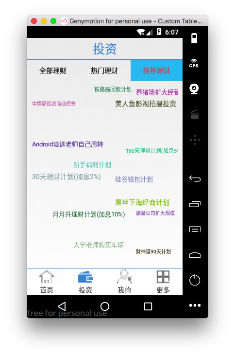

推荐理财中随机飞入效果

[TOC]


## 1. 添加随机飞入布局文件(插件)

> com.example.chen.guigup2p.ui.randomLayout

```
com/example/chen/guigup2p/ui/randomLayout/AnimationUtil.java
com/example/chen/guigup2p/ui/randomLayout/RandomLayout.java
com/example/chen/guigup2p/ui/randomLayout/ShakeListener.java
com/example/chen/guigup2p/ui/randomLayout/StellarMap.java
```

## 2. 推荐理财fragment的布局文件中使用导入的StellarMap
```xml
    <com.example.chen.guigup2p.ui.randomLayout.StellarMap
        android:id="@+id/stallar_map_product_recommod"
        android:layout_width="match_parent"
        android:layout_height="match_parent">

    </com.example.chen.guigup2p.ui.randomLayout.StellarMap>
```


## 3. ProductRecommondFragment 中动态加载stellarmap 数据和视图


### 1. 获取stellarmap (可以是本地/网络数据)

```java
//提供装配的数据
    private String[] datas = new String[]{"新手福利计划", "财神道90天计划", "硅谷钱包计划", "30天理财计划(加息2%)", "180天理财计划(加息5%)", "月月升理财计划(加息10%)",
            "中情局投资商业经营", "大学老师购买车辆", "屌丝下海经商计划", "美人鱼影视拍摄投资", "Android培训老师自己周转", "养猪场扩大经营",
            "旅游公司扩大规模", "铁路局回款计划", "屌丝迎娶白富美计划", "新手福利计划", "财神道90天计划", "硅谷钱包计划", "30天理财计划(加息2%)", "180天理财计划(加息5%)", "月月升理财计划(加息10%)",
            "中情局投资商业经营", "大学老师购买车辆", "屌丝下海经商计划", "美人鱼影视拍摄投资", "Android培训老师自己周转", "养猪场扩大经营",
            "旅游公司扩大规模", "铁路局回款计划", "新手福利计划", "财神道90天计划", "硅谷钱包计划", "30天理财计划(加息2%)", "180天理财计划(加息5%)", "月月升理财计划(加息10%)",
            "中情局投资商业经营", "大学老师购买车辆", "屌丝下海经商计划", "美人鱼影视拍摄投资", "Android培训老师自己周转", "养猪场扩大经营",
            "旅游公司扩大规模", "铁路局回款计划"
    };


```


### 2. initData()初始化操作
-  将datas分为两组(对应stellarmap 的两个group) 
-  创建StellarMap 的装配器adapter
-  为stellarmap 设置adapter
-  stellarMap 设置边界属性
-  stellarMap 调用两个必调方法:方可使用stellarMap 生效
    + 稀疏度
    + 动画

> initData:

```java

    @Override
    protected void initData(String content) {
        //将datas 分为两组
        for (int i=0; i< datas.length ;i++ ){
            if(i< datas.length/2) {
                oneDatas[i] = datas[i];
            }else {
                twoDatas[i- datas.length/2] = datas[i];
            }
        }


        StellarAdapter adapter = new StellarAdapter();
        stellarMap.setAdapter(adapter);

        //设置stellarmap 边界padding
        int left = UIUtils.dp2px(10);
        int top = UIUtils.dp2px(10);
        int right = UIUtils.dp2px(10);
        int bottom = UIUtils.dp2px(10);
        stellarMap.setPadding(left,top,right,bottom);

        //必须调用如下的两个方法，否则stellarMap不能显示数据
        //设置显示的数据在x轴、y轴方向上的稀疏度
        stellarMap.setRegularity(7, 5);
        //设置初始化显示的组别，以及是否需要使用动画
        stellarMap.setGroup(0, true);
    }

```


### 3. 创建StellarMap的Adapter
> 说明:

-  getGroupCount() : 返回数据组数 
-  getCount(int group): 返回地group组中的数据个数
-  *** getView():返回具体的 view视图
    + 创建视图 textview 
    + 设置视图属性
    + 添加点击事件
-  getNextGroupOnPan(int group, float degree) :没有调用,可以不用重写
-  getNextGroupOnZoom(int group, boolean isZoomIn) : 返回交替显示的组


```java
    /**
     * 创建一个stellarmap 装配器类
     */
    class StellarAdapter implements StellarMap.Adapter {

        @Override
        public int getGroupCount() {//返回数据 组数
            return 2;
        }

        @Override
        public int getCount(int group) {//返回地group组中的数据个数
            if (group == 0) {
                return datas.length / 2;
            } else {
                return datas.length - datas.length / 2;
            }
        }
        //返回具体的 view视图
        //position:不同的组别，position都是从0开始。
        @Override
        public View getView(int group, int position, View convertView) {
            //1. 创建tv
            final TextView tv = new TextView(getActivity());
            //2. 设置tv属性
            if (group ==0) {
            tv.setText(oneDatas[position]);
            }else {
                tv.setText(twoDatas[position]);
            }
            //3. 设置文字大小和颜色
            tv.setTextSize(UIUtils.dp2px(10)+UIUtils.dp2px(random.nextInt(5)));

            int red = random.nextInt(200);
            int green = random.nextInt(200);
            int blue = random.nextInt(200);

            tv.setTextColor(Color.rgb(red,green,blue));
            

            //4. 点击事件
            tv.setOnClickListener(new View.OnClickListener() {
                @Override
                public void onClick(View view) {
                    //Toast.makeText(getContext(), tv.getText().toString(), Toast.LENGTH_SHORT).show();
                    UIUtils.toast(tv.getText().toString(),false);
                }
            });
            return tv;
        }
        //返回下一组显示平移动画的组别。查看源码发现，此方法从未被调用。所以可以不重写
        @Override
        public int getNextGroupOnPan(int group, float degree) {
            return 0;
        }
        //返回下一组显示缩放动画的组别。
        @Override
        public int getNextGroupOnZoom(int group, boolean isZoomIn) {
            //使两组相互切换
            if (group == 0) {
                return 1;
            } else {
                return 0;
            }
        }
    }
```
## 4. 效果:
 


