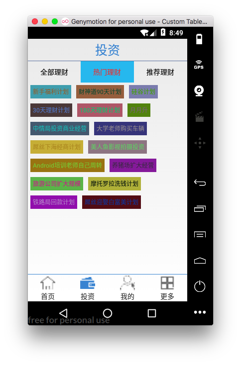

投资: 热门理财实现 Flow布局

[TOC]

# 1. 实现静态页面流式布局
> 文本流为布局文件中写定


## 1. 热门理财:布局文件

```xml
<?xml version="1.0" encoding="utf-8"?>
<LinearLayout xmlns:android="http://schemas.android.com/apk/res/android"
    android:orientation="vertical" android:layout_width="match_parent"
    android:layout_height="match_parent">


    <com.example.chen.guigup2p.ui.flowlayout.FlowLayout
        android:layout_width="match_parent"
        android:layout_height="match_parent">

        <TextView
        android:layout_width="wrap_content"
        android:layout_height="wrap_content"
        android:text="你是我心内的一首歌"
        android:layout_margin="10dp"
        android:textSize="20sp" />

        <TextView
        android:layout_width="wrap_content"
        android:layout_height="wrap_content"
        android:text="涛声依旧"
        android:layout_margin="10dp"
        android:textSize="20sp" />

        <TextView
        android:layout_width="wrap_content"
        android:layout_height="wrap_content"
        android:text="夜夜"
        android:layout_margin="10dp"
        android:textSize="20sp" />

        <TextView
        android:layout_width="wrap_content"
        android:layout_height="wrap_content"
        android:text="月落乌啼霜满天"
        android:layout_margin="10dp"
        android:textSize="20sp" />

        <TextView
        android:layout_width="wrap_content"
        android:layout_height="wrap_content"
        android:text="哇塞"
        android:layout_margin="10dp"
        android:textSize="20sp" />

        <TextView
        android:layout_width="wrap_content"
        android:layout_height="wrap_content"
        android:text="word天哪"
        android:layout_margin="10dp"
        android:textSize="20sp" />

        <TextView
        android:layout_width="wrap_content"
        android:layout_height="wrap_content"
        android:text="你咋不上天呢"
        android:layout_margin="10dp"
        android:textSize="20sp" />


        <TextView
        android:layout_width="wrap_content"
        android:layout_height="wrap_content"
        android:text="你想怎样"
        android:layout_margin="10dp"
        android:textSize="20sp" />

        <TextView
        android:layout_width="wrap_content"
        android:layout_height="wrap_content"
        android:text="夜曲"
        android:layout_margin="10dp"
        android:textSize="20sp" />
    </com.example.chen.guigup2p.ui.flowlayout.FlowLayout>
</LinearLayout>
```

## 2. 创建流式布局视图类
> 自定义FlowLayout: 具体开发中此类可直接使用

```java

/**
 * Created by shkstart on 2016/12/6 0006.
 * 自定义流式布局
 */
public class FlowLayout extends ViewGroup {
    public FlowLayout(Context context) {
        this(context, null);
    }

    public FlowLayout(Context context, AttributeSet attrs) {
        this(context, attrs, 0);
    }

    public FlowLayout(Context context, AttributeSet attrs, int defStyleAttr) {
        super(context, attrs, defStyleAttr);

    }

    private void setChildViewColor() {
        int childCount = getChildCount();
        for (int i = 0; i < childCount; i++) {
            View child = getChildAt(i);

            Random random = new Random();
            int red = random.nextInt(200);
            int green = random.nextInt(200);
            int blue = random.nextInt(200);

            child.setBackgroundColor(Color.rgb(red,green,blue));

        }
    }


    /**
     * 设置背景色
     * @param widthMeasureSpec
     * @param heightMeasureSpec
     */


    //能够设置当前布局的宽度和高度
    @Override
    protected void onMeasure(int widthMeasureSpec, int heightMeasureSpec) {
//        super.onMeasure(widthMeasureSpec, heightMeasureSpec);
        //获取设置的宽高的模式和具体的值
        int widthMode = MeasureSpec.getMode(widthMeasureSpec);
        int heightMode = MeasureSpec.getMode(heightMeasureSpec);
        int widthSize = MeasureSpec.getSize(widthMeasureSpec);
        int heightSize = MeasureSpec.getSize(heightMeasureSpec);

        //如果用户使用的至多模式，那么使用如下两个变量计算真实的宽高值。
        int width = 0;
        int height = 0;

        //每一行的宽度
        int lineWidth = 0;
        int lineHeight = 0;

        //获取子视图
        int childCount = getChildCount();
        for (int i = 0; i < childCount; i++) {
            View childView = getChildAt(i);

            //只有调用了如下的方法，方可计算子视图的测量的宽高
            measureChild(childView, widthMeasureSpec, heightMeasureSpec);

            //获取子视图的宽高
            int childWidth = childView.getMeasuredWidth();
            int childHeight = childView.getMeasuredHeight();
            //要想保证可以获取子视图的边距参数对象，必须重写generateLayoutParams().
            MarginLayoutParams mp = (MarginLayoutParams) childView.getLayoutParams();

            if (lineWidth + childWidth + mp.leftMargin + mp.rightMargin <= widthSize){//不换行

                lineWidth += childWidth + mp.leftMargin + mp.rightMargin;
                lineHeight = Math.max(lineHeight,childHeight + mp.topMargin + mp.bottomMargin);

            }else{//换行
                width = Math.max(width,lineWidth);
                height += lineHeight;

                //重置
                lineWidth = childWidth + mp.leftMargin + mp.rightMargin;
                lineHeight = childHeight + mp.topMargin + mp.bottomMargin;
            }

            //最后一个元素
            if(i == childCount - 1){
                width = Math.max(width,lineWidth);
                height += lineHeight;
            }

        }

        Log.e("TAG", "widthSize = " + widthSize + ",heightSize = " + heightSize);
        Log.e("TAG", "width = " + width + ",height = " + height);


        //设置当前流式布局的宽高
        setMeasuredDimension((widthMode == MeasureSpec.EXACTLY) ? widthSize : width, (heightMode == MeasureSpec.EXACTLY) ? heightSize : height);
    }

    //重写的目的：给每一个子视图指定显示的位置：childView.layout(l,t,r,b);
    private List<List<View>> allViews = new ArrayList<>();//每一行的子视图的集合构成的集合。
    private List<Integer> allHeights = new ArrayList<>();//每一行的高度构成的集合。
    @Override
    protected void onLayout(boolean changed, int l, int t, int r, int b) {

        setChildViewColor();
        //一、给两个集合添加元素。

        //每一行的宽高值
        int lineWidth = 0;
        int lineHeight = 0;

        //提供一个集合，保存一行childView
        List<View> lineList = new ArrayList<>();
        //获取布局的宽度
        int width = this.getMeasuredWidth();

        int childCount = getChildCount();
        for(int i = 0; i < childCount; i++) {
            View childView = getChildAt(i);
            //获取视图的测量宽高、边距
            int childWidth = childView.getMeasuredWidth();
            int childHeight = childView.getMeasuredHeight();

            MarginLayoutParams mp = (MarginLayoutParams) childView.getLayoutParams();

            if(lineWidth + childWidth + mp.leftMargin + mp.rightMargin <= width){//不换行
                lineList.add(childView);
                lineWidth += childWidth + mp.leftMargin + mp.rightMargin;
                lineHeight = Math.max(lineHeight,childHeight + mp.topMargin + mp.bottomMargin);

            }else{//换行
                allViews.add(lineList);
                allHeights.add(lineHeight);

                lineWidth = childWidth + mp.leftMargin + mp.rightMargin;
                lineHeight = childHeight + mp.topMargin + mp.bottomMargin;
                lineList = new ArrayList<>();
                lineList.add(childView);
            }

            if(i == childCount - 1){//如果是最后一个元素
                allViews.add(lineList);
                allHeights.add(lineHeight);
            }

        }

        Log.e("TAG", "allViews.size = " + allViews.size() + ",allHeights.size = " + allHeights.size());

        //二、给每一个子视图指定显示的位置
        int x = 0;
        int y = 0;
        for(int i = 0; i < allViews.size(); i++) {//每遍历一次，对应一行元素
            List<View> lineViews = allViews.get(i);//取出当前行构成的集合
            for(int j = 0; j < lineViews.size(); j++) {
                View childView = lineViews.get(j);
                int childWidth = childView.getMeasuredWidth();
                int childHeight = childView.getMeasuredHeight();

                MarginLayoutParams mp = (MarginLayoutParams) childView.getLayoutParams();

                int left = x + mp.leftMargin;
                int top = y + mp.topMargin;
                int right = left + childWidth;
                int bottom = top + childHeight;

                childView.layout(left,top,right,bottom);

                x +=  childWidth + mp.leftMargin + mp.rightMargin;

            }
            y += allHeights.get(i);
            x = 0;
        }
    }

    @Override
    public LayoutParams generateLayoutParams(AttributeSet attrs) {
        MarginLayoutParams mp = new MarginLayoutParams(getContext(), attrs);
        return mp;

    }
}

```

## 3. 效果: 

 


# 2. 热门理财显示动态数据
## 1. 修改布局文件
```xml
<?xml version="1.0" encoding="utf-8"?>
<LinearLayout xmlns:android="http://schemas.android.com/apk/res/android"
    android:orientation="vertical" android:layout_width="match_parent"
    android:layout_height="match_parent">


    <com.example.chen.guigup2p.ui.flowlayout.FlowLayout
        android:id="@+id/flow_hot"
        android:layout_width="match_parent"
        android:layout_height="match_parent">
    </com.example.chen.guigup2p.ui.flowlayout.FlowLayout>
</LinearLayout>
```


## 2. ProductHotFragment获取数据
```java
    private String[] datas = new String[]{"新手福利计划", "财神道90天计划", "硅谷计划", "30天理财计划", "180天理财计划", "月月升", "中情局投资商业经营", "大学老师购买车辆", "屌丝下海经商计划", "美人鱼影视拍摄投资", "Android培训老师自己周转", "养猪场扩大经营",
            "旅游公司扩大规模", "摩托罗拉洗钱计划", "铁路局回款计划", "屌丝迎娶白富美计划"
    };
```

## 3. ProductHotFragment初始化数据

```java
    @Override
    protected void initData(String content) {
        /**
         * 将datas 中的数据解析到每个单独的textview  并天添加到FlowLayout 中
         */
        Random random = new Random();
        for (int i = 0; i < datas.length; i++) {

            TextView tv = new TextView(getContext());


            //1. 设置文本
            tv.setText(datas[i]);


            //2设置属性
            ViewGroup.MarginLayoutParams mp = new ViewGroup.MarginLayoutParams(ViewGroup.LayoutParams.WRAP_CONTENT, ViewGroup.LayoutParams.WRAP_CONTENT);
            mp.leftMargin = UIUtils.dp2px(5);
            mp.rightMargin = UIUtils.dp2px(5);
            mp.topMargin = UIUtils.dp2px(5);
            mp.bottomMargin = UIUtils.dp2px(5);

            tv.setLayoutParams(mp);//设置边距

            int padding = UIUtils.dp2px(5);
            tv.setPadding(padding, padding, padding, padding);//设置内边距
            tv.setTextSize(UIUtils.dp2px(12));

            //3. 设置颜色
            int red = random.nextInt(211);
            int green = random.nextInt(211);
            int blue = random.nextInt(211);
            tv.setTextColor(Color.rgb(red,green,blue));
            //4. 添加到FlowLayout中
            flowHot.addView(tv);
        }
    }
```

## 4. 效果


# 3. 创建DrawableUtils 工具类,实现textviewshope 和selector 动态修改

## 1. DrawUtils
```
/**
 * Created by shkstart on 2016/12/6 0006.
 */
public class DrawUtils {

    //代替shape 设置圆角和背景色
    public static Drawable getDrawable(int rgb,float radius){
        GradientDrawable gradientDrawable = new GradientDrawable();
        gradientDrawable.setColor(rgb);  //填充颜色
        gradientDrawable.setGradientType(GradientDrawable.RECTANGLE); //shape矩形
        gradientDrawable.setCornerRadius(radius);  //四周圆角半径
        gradientDrawable.setStroke(UIUtils.dp2px(1), rgb); //边框厚度与颜色

        return gradientDrawable;
    }

// 动态selector
    public static StateListDrawable getSelector(Drawable normalDrawable, Drawable pressDrawable) {
        StateListDrawable stateListDrawable = new StateListDrawable();
        //给当前的颜色选择器添加选中图片指向状态，未选中图片指向状态
        stateListDrawable.addState(new int[]{android.R.attr.state_enabled, android.R.attr.state_pressed}, pressDrawable);
        stateListDrawable.addState(new int[]{android.R.attr.state_enabled}, normalDrawable);
        //设置默认状态
        stateListDrawable.addState(new int[]{}, normalDrawable);
        return stateListDrawable;
    }
}

```


## 2. FragmentHot initData 中textView 设置shape和selector 
```java
intData(){
    ...
            // tv.setBackgroundResource(R.drawable.hot_product_shap);
            // 使用自定义DrawableUtils 代替shape
            //使用GradientDrawable替换shape设置TextView
            red = random.nextInt(200);
            green = random.nextInt(200);
            blue = random.nextInt(200);
            tv.setBackground(DrawUtils.getDrawable(Color.rgb(red,green,blue),UIUtils.dp2px(5)));

            //使用StateListDrawable替换selector设置TextView
            // tv 设置点击效果
            //设置textView是可点击的.如果设置了点击事件，则TextView就是可点击的。
            tv.setClickable(true);
            tv.setBackground(DrawUtils.getSelector(DrawUtils.getDrawable(Color.rgb(red, green, blue), UIUtils.dp2px(5)), DrawUtils.getDrawable(Color.WHITE, UIUtils.dp2px(5))));

}

```

## 3. tv添加点击事件

```java
protected void initData(String content) {
        /**
         * 将datas 中的数据解析到每个单独的textview  并天添加到FlowLayout 中
         */

        Random random = new Random();
        for (int i = 0; i < datas.length; i++) {

            final TextView tv = new TextView(getContext());


            //1. 设置文本
            tv.setText(datas[i]);


            //2设置属性
            ViewGroup.MarginLayoutParams mp = new ViewGroup.MarginLayoutParams(ViewGroup.LayoutParams.WRAP_CONTENT, ViewGroup.LayoutParams.WRAP_CONTENT);
            mp.leftMargin = UIUtils.dp2px(5);
            mp.rightMargin = UIUtils.dp2px(5);
            mp.topMargin = UIUtils.dp2px(5);
            mp.bottomMargin = UIUtils.dp2px(5);

            tv.setLayoutParams(mp);//设置边距

            int padding = UIUtils.dp2px(5);
            tv.setPadding(padding, padding, padding, padding);//设置内边距
            tv.setTextSize(UIUtils.dp2px(12));

            //3. 设置颜色

            int red = random.nextInt(211);
            int green = random.nextInt(211);
            int blue = random.nextInt(211);
            tv.setTextColor(Color.rgb(red,green,blue));


            // tv.setBackgroundResource(R.drawable.hot_product_shap);
            // 使用自定义DrawableUtils 代替shape
            //使用GradientDrawable替换shape设置TextView
            red = random.nextInt(200);
            green = random.nextInt(200);
            blue = random.nextInt(200);
            tv.setBackground(DrawUtils.getDrawable(Color.rgb(red,green,blue),UIUtils.dp2px(5)));

            //使用StateListDrawable替换selector设置TextView
            // tv 设置点击效果
            //设置textView是可点击的.如果设置了点击事件，则TextView就是可点击的。
            tv.setClickable(true);
            tv.setBackground(DrawUtils.getSelector(DrawUtils.getDrawable(Color.rgb(red, green, blue), UIUtils.dp2px(5)), DrawUtils.getDrawable(Color.WHITE, UIUtils.dp2px(5))));


            tv.setOnClickListener(new View.OnClickListener() {
                @Override
                public void onClick(View view) {
                    UIUtils.toast(tv.getText().toString(),false);
                }
            });

            //4. 添加到FlowLayout中
            flowHot.addView(tv);
        }


    }
```

## 4. 效果
 


