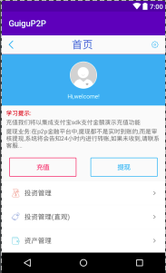

我的资产页面

[TOC]

# 1. 登录功能实现

## 1. 界面布局

> layout/fragment_my.xml

```xml
<?xml version="1.0" encoding="utf-8"?>
<LinearLayout xmlns:android="http://schemas.android.com/apk/res/android"
    android:orientation="vertical" android:layout_width="match_parent"
    android:layout_height="match_parent">
    <include  layout="@layout/top_title_main"/>


    <!--登录界面-->

    <com.example.chen.guigup2p.ui.MyScrollView
        android:layout_width="match_parent"
        android:layout_height="match_parent">

        <LinearLayout
            android:layout_width="match_parent"
            android:layout_height="match_parent"
            android:orientation="vertical">

            <RelativeLayout
                android:id="@+id/rl_me"
                android:layout_width="match_parent"
                android:layout_height="120dp"
                android:background="@color/my_title_bg"
                android:gravity="center">

                <RelativeLayout
                    android:id="@+id/rl_me_icon"
                    android:layout_width="wrap_content"
                    android:layout_height="wrap_content"
                    android:layout_marginTop="4dp"
                    android:layout_centerHorizontal="true">

                    <ImageView
                        android:layout_width="64dp"
                        android:layout_height="64dp"
                        android:scaleType="fitXY"
                        android:src="@drawable/my_user_bg_icon" />

                    <ImageView
                        android:id="@+id/iv_me_icon"
                        android:layout_width="62dp"
                        android:layout_height="62dp"
                        android:layout_centerInParent="true"
                        android:scaleType="fitXY"
                        android:src="@drawable/my_user_default" />
                </RelativeLayout>

                <TextView
                    android:id="@+id/tv_me_name"
                    android:layout_width="match_parent"
                    android:layout_height="wrap_content"
                    android:layout_below="@id/rl_me_icon"
                    android:layout_marginTop="10dp"
                    android:gravity="center"
                    android:text="Hi,welcome!"
                    android:textColor="@color/white"
                    android:textSize="14sp" />
            </RelativeLayout>


            <LinearLayout
                android:layout_width="match_parent"
                android:layout_height="wrap_content"
                android:layout_margin="10dp"
                android:orientation="vertical">

                <TextView
                    android:layout_width="match_parent"
                    android:layout_height="wrap_content"
                    android:text="学习提示:"
                    android:textColor="@android:color/holo_red_dark" />

                <TextView
                    android:layout_width="match_parent"
                    android:layout_height="wrap_content"
                    android:layout_marginTop="5dp"
                    android:text="充值我们将以集成支付宝sdk支付金额演示充值功能" />

                <TextView
                    android:layout_width="match_parent"
                    android:layout_height="wrap_content"
                    android:layout_marginTop="5dp"
                    android:text="提现业务:在p2p金融平台中,提现都不是实时到账的,而是审核提现,系统将会告知24小时内进行转账,如果未收到,请联系客服..." />
            </LinearLayout>

            <LinearLayout
                android:layout_width="match_parent"
                android:layout_height="wrap_content"
                android:layout_margin="10dp"
                android:gravity="center">

                <ImageView
                    android:id="@+id/recharge"
                    android:layout_width="0dp"
                    android:layout_height="wrap_content"
                    android:layout_marginRight="9dp"
                    android:layout_weight="1"
                    android:src="@drawable/my_recharge_bg" />

                <ImageView
                    android:id="@+id/withdraw"
                    android:layout_width="0dp"
                    android:layout_height="wrap_content"
                    android:layout_marginLeft="9dp"
                    android:layout_weight="1"
                    android:src="@drawable/my_withdraw_bg" />
            </LinearLayout>

            <!--充分使用textview属性代替LinearLayout布局-->
            <TextView
                android:id="@+id/ll_touzi"
                style="@style/LoginStyle"
                android:drawableLeft="@drawable/my_invest_manage"
                android:text="投资管理" />

            <TextView
                android:id="@+id/ll_touzi_zhiguan"
                style="@style/LoginStyle"
                android:drawableLeft="@drawable/my_reward_manage"
                android:text="投资管理(直观)" />

            <TextView
                android:id="@+id/ll_zichan"
                style="@style/LoginStyle"
                android:drawableLeft="@drawable/my_asset_manage"
                android:text="资产管理" />
        </LinearLayout>
    </com.example.chen.guigup2p.ui.MyScrollView>

</LinearLayout>

```
> 布局

 


## 2. FragmentMy 中判断用户是否登录 
> initData() 中判断用户是否登录


```java
    /**
     * 显示页面前判断用户是否登录
     * > 登陆过: 加载本地sp
     * > 未登录: 显示登录对话框
     * @return
     */
    public void isLogin() {
        SharedPreferences sp = this.getActivity().getSharedPreferences("user_info", Context.MODE_PRIVATE);
        String userName = sp.getString("name", "");

        if (TextUtils.isEmpty(userName)) {
            //提示登录对话框
            doAlertLoginDialog();//弹出对话框提示登录并获取数据

        } else {//已经登录
            doLoadingLocalUser();//本地登录 加载本地sp 用户信息登录
        }

    }
Multi-line Code
```


### 1.登陆过: 加载本地sp
> doLoadingLocalUser();//本地登录 加载本地sp 用户信息登录

```java
    private void doLoadingLocalUser() {
        BaseActivity mainActivity = (BaseActivity) getActivity();
        User user = mainActivity.readUser();//BaseActivity 抽象方法 readUser
        showUserInfo(user);
    }
```

### 2.未登录: 显示登录对话框

- 取消登录:跳转到主页
- 确定登录:启动登录界面

```java
/**
     * 提示登录对话框
     */
    private void doAlertLoginDialog() {
        new android.app.AlertDialog.Builder(this.getActivity())
                .setTitle("提示")
                .setMessage("您还没有登录哦！需要登录吗??")
                .setPositiveButton("确定", new DialogInterface.OnClickListener() {
                    @Override
                    public void onClick(DialogInterface dialog, int which) {
                        startLoginActivity(); //确定登录:启动登录界面
                    }
                })
                .setNegativeButton("取消", new DialogInterface.OnClickListener() {
                    @Override
                    public void onClick(DialogInterface dialogInterface, int i) {
                        UIUtils.toast("取消登录",false);
                        //取消登录: 跳转到主页
                        BaseActivity mainActivity = (BaseActivity) MyFragment.this.getActivity();
                        mainActivity.goToActivity(MainActivity.class,null);
                    }
                })
                //.setCancelable(false)
                .show();


    }
Multi-line Code
```


### 3.启动登录Activity

```java
    private void startLoginActivity() {
/*
        Intent intent = new Intent(MyFragment.this.getContext(), LoginActivity.class);
        startActivity(intent);
*/
        //方式二: 使用BaseActivty --中的gotoActivity() 启动
        // ((BaseActivity) MyFragment.this.getActivity()).goToActivity(LoginActivity.class, null);
        //方式二:启动登录activity
        BaseActivity mainActivity = (BaseActivity) MyFragment.this.getActivity();
        mainActivity.goToActivity(LoginActivity.class,null);

    }
Multi-line Code
```

## 3. LoginActivity 
### 1. button 点击事件:登录
```java
    @OnClick(R.id.btn_login)
    public void login(View view) {//登录按钮的点击事件

        //1. 获取手机号和密码
        String phone = etLoginNumber.getText().toString().trim();
        String pwd = etLoginPwd.getText().toString().trim();

        //2. 若不为空执行联网请求
        if(TextUtils.isEmpty(phone)||TextUtils.isEmpty(pwd)) {
            UIUtils.toast("用户名或密码不能为空",false);
        }else {
            doLogin(phone,pwd);
        }
    }

```


### 2. 具体登录功能实现


```java
/**
     * 执行联网操作
     * @param phone :登录手机号
     * @param pwd   :登录密码
     */
    private void doLogin(String phone, String pwd) {
        //1. 获取联网地址
        String loginUrl = AppNetConfig.LOGIN;
        //baseActivity 中的异步请求
        RequestParams params = new RequestParams();
        params.put("phone",phone);
        params.put("password", MD5Utils.MD5(pwd));//使用md5加密密码
        client.post(loginUrl,params,new AsyncHttpResponseHandler(){
            @Override
            public void onSuccess(String content) {
                //检验成功:
                /*content  = {
                "data": {
                    "name": "shkstart",
                            "imageurl": "http://192.168.1.104:8080/P2PInvest/images/tx.png",
                            "iscredit": "true",
                            "phone": "13012341234"
                },
                "success": true
                 */
                //检验失败:
                //content = {"success":false}

                if(TextUtils.isEmpty(content)) {//数据库未启动
                    UIUtils.toast("读取服务器数据异常",false);
                    return;
                }
                JSONObject jsonObject = JSON.parseObject(content);
                Boolean success = jsonObject.getBoolean("success");

                if(success) {
                    //登录成功--解析用户数据

                    String data = jsonObject.getString("data");
                    User user = JSON.parseObject(data, User.class);

                    //2. 保存用户登录信息 到sp

                    saveUser(user);
                    //3. 销毁所有登录activity
                    removeAll();

                    //4. 跳转到mainActivity
                    goToActivity(MainActivity.class,null);

                }else {
                    UIUtils.toast("用户名或密码错误",false);
                }
            }
            @Override
            public void onFailure(Throwable error, String content) {
                //联网失败:提示
                UIUtils.toast("联网失败",false);
            }
        });

    }
```

## 4. 登录成功后跳转到主页面:MyFragment

 

