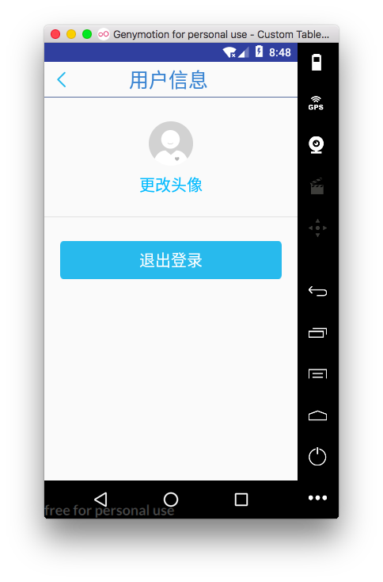

修改用户头像

[TOC]

> 需求: 点击用户头像 显示用户详细信息
> 用户详细信息页面支持修改用户头像: 
  - 相机
  - 图库


# 1. 用户信息展示布局: 

   

# 2. 点击事件

> 点击头像
> 点击文字

```java

    @OnClick(R.id.tv_user_change)
    public  void userChangeClick(View view){
        //提示dialog 更改头像
       // alertChangeIconDialog();
        checkRunTimePermission();//检查运行时权限
    }

    @OnClick(R.id.iv_user_icon)
    public  void userIconClick(View view){
        //提示dialog 更改头像
//        alertChangeIconDialog();
            checkRunTimePermission();
    }

```


## 1. 检查运行时权限
  
```java

    /**
     * 判断运行时权限
     */
    private void checkRunTimePermission(){
        if(ContextCompat.checkSelfPermission(UserInfoActivity.this, android.Manifest.permission.WRITE_EXTERNAL_STORAGE )!= PackageManager.PERMISSION_GRANTED) {
            ActivityCompat.requestPermissions(UserInfoActivity.this,new String[]{android.Manifest.permission.WRITE_EXTERNAL_STORAGE},1);
        }else {
            UIUtils.toast("已经授予权限",false);
            alertChangeIconDialog();//启动对话框 并选择图片
        }
    }


    @Override
    public void onRequestPermissionsResult(int requestCode, @NonNull String[] permissions, @NonNull int[] grantResults) {
        super.onRequestPermissionsResult(requestCode, permissions, grantResults);
        switch (requestCode) {
            case 1:
                if (grantResults.length > 0 && grantResults[0] == PackageManager.PERMISSION_GRANTED) {
                alertChangeIconDialog();

            } else {
                Toast.makeText(this, "申请权限被拒绝，关闭程序", Toast.LENGTH_SHORT).show();
                finish();//关闭
            }
            break;

        }
    }

```

## 2. 启动对话框(选择来源 相机:图库)
>  

```java
  /**
     * 弹出更改头像对话框
     */
    private void alertChangeIconDialog() {


        //1. 弹出提示框
        String[] items = new String[]{"图库","相机"};
        new AlertDialog.Builder(this).setTitle("选择来源")
                .setItems(items, new DialogInterface.OnClickListener() {
                    @Override
                    public void onClick(DialogInterface dialogInterface, int i) {

                        switch (i){
                            case 0://图库
                                //启动其他应用的activity:使用隐式意图
                                Intent picture = new Intent(Intent.ACTION_PICK, MediaStore.Images.Media.EXTERNAL_CONTENT_URI);

                                startActivityForResult(picture,PICTURE);

                                break;
                            case 1://相机

                                Intent camera = new Intent(MediaStore.ACTION_IMAGE_CAPTURE);
                                startActivityForResult(camera,CAMERA);

                                break;
                        }


                    }
                })
                .setCancelable(false)
                .show();

    }

Multi-line Code
```


## 3. 选择来源 的回调
```java
/**
     * 待回调启动相机/图库的回调方法
     */
    @Override
    protected void onActivityResult(int requestCode, int resultCode, Intent data) {
        if(requestCode==CAMERA&&resultCode==RESULT_OK&& data!=null) { //图库回调
            Bundle extras = data.getExtras();
            Bitmap bitmap = (Bitmap) extras.get("data");

            //修改图片: 压缩,圆形

            Bitmap zoom = BitmapUtils.zoom(bitmap, ivUserIcon.getWidth(), ivUserIcon.getHeight());
             zoom = BitmapUtils.circleBitmap(zoom);//压缩
            //3. 显示bitmap
            ivUserIcon.setImageBitmap(zoom);
            //4. bitmap 上传到服务器
            //5. 保存到本地缓存 :bitmap ? zoom
            saveImageToLocal(bitmap);
        }else if(requestCode==PICTURE&& resultCode==RESULT_OK && data!=null) {//相机回调
            //图库
            Uri selectImage= data.getData();
            //android各个不同的系统版本,对于获取外部存储上的资源，返回的Uri对象都可能各不一样,
            // 所以要保证无论是哪个系统版本都能正确获取到图片资源的话就需要针对各种情况进行一个处理了
            //这里返回的uri情况就有点多了
            //在4.4.2之前返回的uri是:content://media/external/images/media/3951或者file://....
            // 在4.4.2返回的是content://com.android.providers.media.documents/document/image

            String path = getPath(selectImage);

            //根据path 获取bitmap
            Bitmap bitmap = BitmapFactory.decodeFile(path);

            //2. 修改尺寸bitmap 压缩,圆形处理

            Bitmap zoom = BitmapUtils.zoom(bitmap, ivUserIcon.getWidth(), ivUserIcon.getHeight());
            zoom = BitmapUtils.circleBitmap(zoom);
            //3. 显示bitmap
            ivUserIcon.setImageBitmap(zoom);
            //4. bitmap 上传到服务器
            //5. 保存到本地缓存 :bitmap ? zoom
            saveImageToLocal(bitmap);
        }
    }
Multi-line Code
```


## 4. 从图库返回图片地址相关方法

```java
   /*--------------------从图库获取返回图片地址------------------------------------------*/

    /**
     * 根据系统相册选择的文件获取路径
     *
     * @param uri
     */
    @SuppressLint("NewApi")
    private String getPath(Uri uri) {
        int sdkVersion = Build.VERSION.SDK_INT;
        //高于4.4.2的版本
        if (sdkVersion >= 19) {
            Log.e("TAG", "uri auth: " + uri.getAuthority());
            if (isExternalStorageDocument(uri)) {
                String docId = DocumentsContract.getDocumentId(uri);
                String[] split = docId.split(":");
                String type = split[0];
                if ("primary".equalsIgnoreCase(type)) {
                    return Environment.getExternalStorageDirectory() + "/" + split[1];
                }
            } else if (isDownloadsDocument(uri)) {
                final String id = DocumentsContract.getDocumentId(uri);
                final Uri contentUri = ContentUris.withAppendedId(Uri.parse("content://downloads/public_downloads"),
                        Long.valueOf(id));
                return getDataColumn(this, contentUri, null, null);
            } else if (isMediaDocument(uri)) {
                final String docId = DocumentsContract.getDocumentId(uri);
                final String[] split = docId.split(":");
                final String type = split[0];

                Uri contentUri = null;
                if ("image".equals(type)) {
                    contentUri = MediaStore.Images.Media.EXTERNAL_CONTENT_URI;
                } else if ("video".equals(type)) {
                    contentUri = MediaStore.Video.Media.EXTERNAL_CONTENT_URI;
                } else if ("audio".equals(type)) {
                    contentUri = MediaStore.Audio.Media.EXTERNAL_CONTENT_URI;
                }
                final String selection = "_id=?";
                final String[] selectionArgs = new String[]{split[1]};
                return getDataColumn(this, contentUri, selection, selectionArgs);
            } else if (isMedia(uri)) {
                String[] proj = {MediaStore.Images.Media.DATA};
                Cursor actualimagecursor = this.managedQuery(uri, proj, null, null, null);
                int actual_image_column_index = actualimagecursor.getColumnIndexOrThrow(MediaStore.Images.Media.DATA);
                actualimagecursor.moveToFirst();
                return actualimagecursor.getString(actual_image_column_index);
            }


        } else if ("content".equalsIgnoreCase(uri.getScheme())) {
            // Return the remote address
            if (isGooglePhotosUri(uri))
                return uri.getLastPathSegment();
            return getDataColumn(this, uri, null, null);
        }
        // File
        else if ("file".equalsIgnoreCase(uri.getScheme())) {
            return uri.getPath();
        }
        return null;
    }

    /**
     * uri路径查询字段
     *
     * @param context
     * @param uri
     * @param selection
     * @param selectionArgs
     * @return
     */
    public static String getDataColumn(Context context, Uri uri, String selection, String[] selectionArgs) {
        Cursor cursor = null;
        final String column = "_data";
        final String[] projection = {column};
        try {
            cursor = context.getContentResolver().query(uri, projection, selection, selectionArgs, null);
            if (cursor != null && cursor.moveToFirst()) {
                final int index = cursor.getColumnIndexOrThrow(column);
                return cursor.getString(index);
            }
        } finally {
            if (cursor != null)
                cursor.close();
        }
        return null;
    }


    private boolean isExternalStorageDocument(Uri uri) {
        return "com.android.externalstorage.documents".equals(uri.getAuthority());
    }

    public static boolean isDownloadsDocument(Uri uri) {
        return "com.android.providers.downloads.documents".equals(uri.getAuthority());
    }

    public static boolean isMediaDocument(Uri uri) {
        return "com.android.providers.media.documents".equals(uri.getAuthority());
    }

    public static boolean isMedia(Uri uri) {
        return "media".equals(uri.getAuthority());
    }

    /**
     * @param uri The Uri to check.
     * @return Whether the Uri authority is Google Photos.
     */
    public static boolean isGooglePhotosUri(Uri uri) {
        return "com.google.android.apps.photos.content".equals(uri.getAuthority());
    }

Multi-line Code
```

## 5. 保存图片到本地
```java

    /**
     * 将修改后的图片保存到本地缓存
     *      * 数据的存储。（5种）
     * Bimap:内存层面的图片对象。
     *
     * 存储--->内存：
     *      BitmapFactory.decodeFile(String filePath);
     *      BitmapFactory.decodeStream(InputStream is);
     * 内存--->存储：
     *      bitmap.compress(Bitmap.CompressFormat.PNG,100,OutputStream os);
     * @param bitmap
     */
    private void saveImageToLocal(Bitmap bitmap) {


        String externalStorageState = Environment.getExternalStorageState();
        String mediaMounted = Environment.MEDIA_MOUNTED;

        File filesDir ;
        if(externalStorageState.equals(mediaMounted)) {
            filesDir = this.getExternalFilesDir("");
        }else {
            filesDir = this.getFilesDir();
        }


        OutputStream os = null;
        try {

            File file = new File(filesDir,"icon.png");
            os = new FileOutputStream(file);
            bitmap.compress(Bitmap.CompressFormat.PNG,100,os);


        } catch (FileNotFoundException e) {
            e.printStackTrace();
        }finally {
            if(os!=null) {
                try {
                    os.close();

                } catch (IOException e) {
                    e.printStackTrace();
                }
            }
        }


        //File externalStorageDirectory = Environment.getExternalStorageDirectory();//storage/emulated/0
        //File externalFilesDir = this.getExternalFilesDir("");//storage/emulated/0/Android/data/com.example.chen.guigup2p/files
        //File filesDir = this.getFilesDir(); //filesDir:/data/user/0/com.example.chen.guigup2p/files


    }
Multi-line Code
```

# 3. 退出登录按钮
```java

    /**
     * 退出登录 button 点击事件
     * 1. 清空本地sp
     * 2. 清空本地用户头像
     * 3. 销毁所有activity
     * 4. gotoMainActivity()
     * @param view
     */
    @OnClick(R.id.btn_user_logout)
    public  void logout(View view){

        SharedPreferences user_info = this.getSharedPreferences("user_info", Context.MODE_PRIVATE);
        user_info.edit().clear().commit();//清空sp中大数据,但是sp对应的文件任然存在

        //2

        String externalStorageState = Environment.getExternalStorageState();
        String mediaMounted = Environment.MEDIA_MOUNTED;

        File fileDir ;
        if(externalStorageState.equals(mediaMounted)) {//挂载sd
            fileDir = this.getExternalFilesDir("");
        }else {
            fileDir = this.getFilesDir();
        }

        File img = new File(fileDir,"icon.png");

        if(img.exists()) {
            img.delete();
        }

        //3

        this.removeAll();
        //4.
        this.goToActivity(MainActivity.class,null);


    }
Multi-line Code
```


