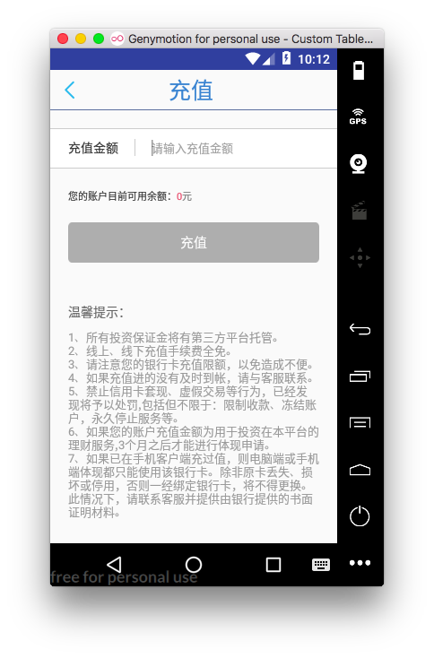
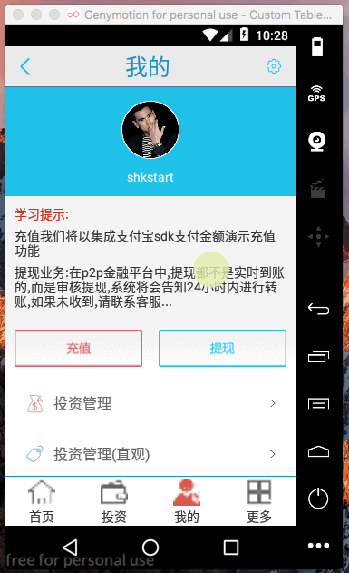

充值功能实现

# 1. 支付宝支付功能集成

## 1. 商家用户签约
> 实际开发中运营操作

## 2. 集成支付宝sdk
### 1.添加jar包
> add aslibrary


### 2.manifest 中添加两个支付页面Activit注册

> add 

```xml
<activity
android:name="com.alipay.sdk.app.H5PayActivity"
android:configChanges="orientation|keyboardHidden|navigation"
android:exported="false"
android:screenOrientation="behind" >
</activity>
<activity
android:name="com.alipay.sdk.auth.AuthActivity"
android:configChanges="orientation|keyboardHidden|navigation"
android:exported="false"
android:screenOrientation="behind" >
</activity>
Multi-line Code
```


### 3.添加权限

```xml
<uses-permission android:name="android.permission.INTERNET" />
<uses-permission android:name="android.permission.ACCESS_NETWORK_STATE" />
<uses-permission android:name="android.permission.ACCESS_WIFI_STATE" />
<uses-permission android:name="android.permission.READ_PHONE_STATE" />
<uses-permission android:name="android.permission.WRITE_EXTERNAL_STORAGE"/>
<uses-permission android:name="android.permission.ACCESS_COARSE_LOCATION"/>
Multi-line Code
```


# 2.充值按钮页面跳转
> 点击充值button 跳转到支付页面

## 1.MyFragment 添加点击事件

## 2.创建ChongzhiActivity 和布局
>充值页面布局

 


> activity 初始化

```java
    @Override
    protected void initTitle() {
        ivTopTitleBack.setVisibility(View.VISIBLE);

        ivTopTitleSetting.setVisibility(View.INVISIBLE);
        tvTopTitleTap.setText("充值");
    }

    @Override
    protected int getLayoutId() {
        return R.layout.activity_chong_zhi;
    }
Multi-line Code
```

```java
    @OnClick(R.id.iv_title_back)
    public void back(View view){
        this.removeCurrentActivity();
    }

Multi-line Code
```


# 3.充值按钮状态切换
> 充值面额不为0 且有值时, 设置button背景色和可以点击 : initData()

```java


    @Override
    protected void initData() {

        //默认状态button 不可点击
        btnChongzhi.setEnabled(false);

        //2. 设置充值edittext 更改监听

        etChongzhi.addTextChangedListener(new TextWatcher() {
            @Override
            public void beforeTextChanged(CharSequence charSequence, int i, int i1, int i2) {
                
            }

            @Override
            public void onTextChanged(CharSequence charSequence, int i, int i1, int i2) {

            }

            @Override
            public void afterTextChanged(Editable editable) {
                String content = etChongzhi.getText().toString().trim();

                if(TextUtils.isEmpty(content)) {
                    btnChongzhi.setEnabled(false);
                    btnChongzhi.setBackgroundResource(R.drawable.btn_02);
                }else {
                    btnChongzhi.setEnabled(true);
                    btnChongzhi.setBackgroundResource(R.drawable.btn_01);
                }

            }
        });

    }
```

> 效果

 


# 4.充值功能实现
> 点击button 启动支付宝,进行充值操作 具体

## 1. button点击事件
### 1.判断支付宝是否安装 

```java
    /**
     * 充值按钮响应:
     * 根据alipay_ demo中pay实现(搬移)
     * @param view
     */
    @OnClick(R.id.btn_chongzhi)
    public void chongZhiOnclick(View view){
        //启动充值

        //检查支付宝是否安装
        if(checkAliPayInstalled(this.getApplicationContext())) {
            startAilipay();//启用支付宝支付
        }else {
            UIUtils.toast("支付宝未安装",false);
        }
    }

```


```java

    /**
     * 检查支付宝是否安装
     * @param context
     * @return
     */
    public static boolean checkAliPayInstalled(Context context) {

        Uri uri = Uri.parse("alipays://platformapi/startApp");
        Intent intent = new Intent(Intent.ACTION_VIEW, uri);
        ComponentName componentName = intent.resolveActivity(context.getPackageManager());

        return componentName != null;
    }

Multi-line Code
```


### 2.启动支付宝
> 启动支付宝相关代码

> handler 提交充值操作

```java

    private Handler mHandler = new Handler() {
        public void handleMessage(Message msg) {
            switch (msg.what) {
                case SDK_PAY_FLAG: {
                    PayResult payResult = new PayResult((String) msg.obj);

                    // 支付宝返回此次支付结果及加签，建议对支付宝签名信息拿签约时支付宝提供的公钥做验签
                    String resultInfo = payResult.getResult();

                    String resultStatus = payResult.getResultStatus();

                    // 判断resultStatus 为“9000”则代表支付成功，具体状态码代表含义可参考接口文档
                    if (TextUtils.equals(resultStatus, "9000")) {
                        Toast.makeText(ChongZhiActivity.this, "支付成功",
                                Toast.LENGTH_SHORT).show();
                    } else {
                        // 判断resultStatus 为非“9000”则代表可能支付失败
                        // “8000”代表支付结果因为支付渠道原因或者系统原因还在等待支付结果确认，最终交易是否成功以服务端异步通知为准（小概率状态）
                        if (TextUtils.equals(resultStatus, "8000")) {
                            Toast.makeText(ChongZhiActivity.this, "支付结果确认中",
                                    Toast.LENGTH_SHORT).show();

                        } else {
                            // 其他值就可以判断为支付失败，包括用户主动取消支付，或者系统返回的错误
                            Toast.makeText(ChongZhiActivity.this, "支付失败",
                                    Toast.LENGTH_SHORT).show();

                        }
                    }
                    break;
                }
                default:
                    break;
            }
        };
    };
Multi-line Code
```


```java
 /**
     * 支付宝支付
     */
    private void startAilipay() {


        // 订单
        String orderInfo = getOrderInfo("测试的商品", "该测试商品的详细描述", "0.01");

        // 对订单做RSA 签名
        String sign = sign(orderInfo);
        try {
            // 仅需对sign 做URL编码
            sign = URLEncoder.encode(sign, "UTF-8");
        } catch (UnsupportedEncodingException e) {
            e.printStackTrace();
        }

        // 完整的符合支付宝参数规范的订单信息
        final String payInfo = orderInfo + "&sign=\"" + sign + "\"&"
                + getSignType();

        Runnable payRunnable = new Runnable() {

            @Override
            public void run() {
                // 构造PayTask 对象
                PayTask alipay = new PayTask(ChongZhiActivity.this);
                // 调用支付接口，获取支付结果
                String result = alipay.pay(payInfo);

                Message msg = new Message();
                msg.what = SDK_PAY_FLAG;
                msg.obj = result;
                mHandler.sendMessage(msg);
            }
        };

        // 必须异步调用
        Thread payThread = new Thread(payRunnable);
        payThread.start();

    }


    /**
     * create the order info. 创建订单信息
     *
     */
    public String getOrderInfo(String subject, String body, String price) {
        // 签约合作者身份ID
        String orderInfo = "partner=" + "\"" + PARTNER + "\"";

        // 签约卖家支付宝账号
        orderInfo += "&seller_id=" + "\"" + SELLER + "\"";

        // 商户网站唯一订单号
        orderInfo += "&out_trade_no=" + "\"" + getOutTradeNo() + "\"";

        // 商品名称
        orderInfo += "&subject=" + "\"" + subject + "\"";

        // 商品详情
        orderInfo += "&body=" + "\"" + body + "\"";

        // 商品金额
        orderInfo += "&total_fee=" + "\"" + price + "\"";

        // 服务器异步通知页面路径
        orderInfo += "&notify_url=" + "\"" + "http://notify.msp.hk/notify.htm"
                + "\"";

        // 服务接口名称， 固定值
        orderInfo += "&service=\"mobile.securitypay.pay\"";

        // 支付类型， 固定值
        orderInfo += "&payment_type=\"1\"";

        // 参数编码， 固定值
        orderInfo += "&_input_charset=\"utf-8\"";

        // 设置未付款交易的超时时间
        // 默认30分钟，一旦超时，该笔交易就会自动被关闭。
        // 取值范围：1m～15d。
        // m-分钟，h-小时，d-天，1c-当天（无论交易何时创建，都在0点关闭）。
        // 该参数数值不接受小数点，如1.5h，可转换为90m。
        orderInfo += "&it_b_pay=\"30m\"";

        // extern_token为经过快登授权获取到的alipay_open_id,带上此参数用户将使用授权的账户进行支付
        // orderInfo += "&extern_token=" + "\"" + extern_token + "\"";

        // 支付宝处理完请求后，当前页面跳转到商户指定页面的路径，可空
        orderInfo += "&return_url=\"m.alipay.com\"";

        // 调用银行卡支付，需配置此参数，参与签名， 固定值 （需要签约《无线银行卡快捷支付》才能使用）
        // orderInfo += "&paymethod=\"expressGateway\"";

        return orderInfo;
    }
    /**
     * sign the order info. 对订单信息进行签名
     *
     * @param content
     *            待签名订单信息
     */
    public String sign(String content) {
        return SignUtils.sign(content, RSA_PRIVATE);
    }

    /**
     * get the sign type we use. 获取签名方式
     *
     */
    public String getSignType() {
        return "sign_type=\"RSA\"";
    }

    /**
     * get the out_trade_no for an order. 生成商户订单号，该值在商户端应保持唯一（可自定义格式规范）
     *
     */
    public String getOutTradeNo() {
        SimpleDateFormat format = new SimpleDateFormat("MMddHHmmss",
                Locale.getDefault());
        Date date = new Date();
        String key = format.format(date);

        Random r = new Random();
        key = key + r.nextInt();//next(32)
        key = key.substring(0, 15);
        return key;
    }
Multi-line Code
```

