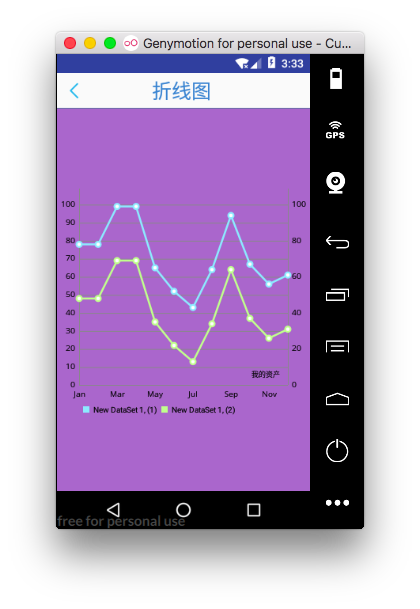
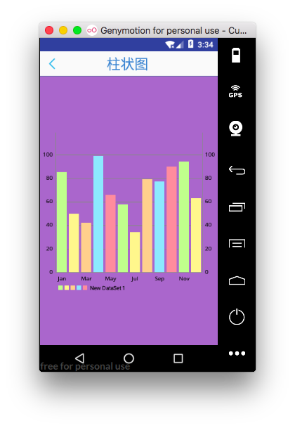
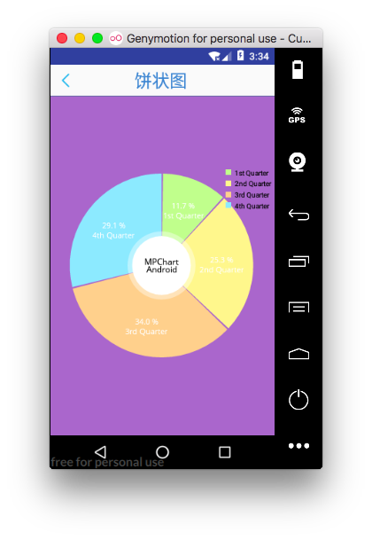

我的资产图表显示

[TOC]

# 0.使用第三方框架
> 第三方库:  https://github.com/PhilJay/MPAndroidChart
## 1. 导入lib
## 2. 导入demo(example)
---

# 1.绘制三种图表 
> 分别创建三种曲线的Activity视图和布局文件
## 1.创建Activity 和布局文件
> LineCharActivity.java :activity_line_chart
> BarCharActivity.java :activity_bar_chart
> PieCharActivity.java :activity_pie_chart


## 2.MyFragment设置点击事件响应
> 跳转到LineCharActivity

```java
    @OnClick(R.id.ll_touzi)
    public  void touziOnclick(View view){

        ((BaseActivity)this.getActivity()).goToActivity(LineChartActivity.class,null);

    }

```


> 跳转到BarCharActivity

```java
    @OnClick(R.id.ll_touzi_zhiguan)
    public  void zhiguanOnclick(View view){
        ((BaseActivity)this.getActivity()).goToActivity(BarChartAcivity.class,null);

    }
```


> 跳转到PieCharActivity

```java
    @OnClick(R.id.ll_zichan)
    public  void zichanOnclick(View view){
        ((BaseActivity)this.getActivity()).goToActivity(PieChartActivity.class,null);

    }
```


## 3.创建LineCharActivity数据处理和图表绘制

---


# 2.具体三种图表实现

## 1.折线图

### 1.initTile() + back
```java
    @Override
    protected void initTitle() {
        ivTitleBack.setVisibility(View.VISIBLE);
        ivTitleSetting.setVisibility(View.INVISIBLE);
        tvTitle.setText("折线图");
    }

    @OnClick(R.id.iv_top_title_back)
    public  void backOnclick(View view){
        removeCurrentActivity();
    }


```


### 2.initData()
> 参考demo中:
com.xxmassdeveloper.mpchartexample.listviewitems.LineChartItem
com.xxmassdeveloper.mpchartexample.ListViewMultiChartActivity

```java

    //字体
    private Typeface mTf;


    @Override
    protected void initData() {

        mTf = Typeface.createFromAsset(getAssets(), "OpenSans-Regular.ttf");


        // apply styling
        // holder.chart.setValueTypeface(mTf);
        //设置图表描述
        lineChart.setDescription("我的资产");

        //绘制网格背景
        lineChart.setDrawGridBackground(false);


        //获取图表X 轴
        XAxis xAxis = lineChart.getXAxis();

        //x 轴显示位置
        xAxis.setPosition(XAxis.XAxisPosition.BOTTOM);
        //字体
        xAxis.setTypeface(mTf);
        //x轴网格线
        xAxis.setDrawGridLines(false);
        //是否绘制x 轴
        xAxis.setDrawAxisLine(true);


        //获取 左Y 轴
        YAxis leftAxis = lineChart.getAxisLeft();
        //Y轴字体
        leftAxis.setTypeface(mTf);
        //Y轴的区间个数 参数1:区间个数,参数2: 区间是否平分(false:均匀,true:不均匀)
        leftAxis.setLabelCount(15, false);

        //获取右侧 Y 轴
        YAxis rightAxis = lineChart.getAxisRight();
        rightAxis.setTypeface(mTf);
        rightAxis.setLabelCount(5, false);
        rightAxis.setDrawGridLines(false);

        // set data
        LineData lineData = generateDataLine(1);
        lineChart.setData((LineData) lineData);

        // do not forget to refresh the chart
        //lineChart.invalidate();
        lineChart.animateX(750);//设置动画时间


    }
Multi-line Code
```

### 3.generateDataLine

```java

    /**
     * generates a random ChartData object with just one DataSet
     * 提供折线数据: 将服务器数据转换为绘制图表需要的数据类型
     *
     * @return
     */
    private LineData generateDataLine(int cnt) {

        //折线1
        ArrayList<Entry> e1 = new ArrayList<Entry>();

        for (int i = 0; i < 12; i++) {
            e1.add(new Entry((int) (Math.random() * 65) + 40, i));
        }

        LineDataSet d1 = new LineDataSet(e1, "New DataSet " + cnt + ", (1)");
        d1.setLineWidth(2.5f);
        d1.setCircleSize(4.5f);
        d1.setHighLightColor(Color.rgb(244, 117, 117));
        d1.setDrawValues(false);//数据标注


        //折线二
        ArrayList<Entry> e2 = new ArrayList<Entry>();

        for (int i = 0; i < 12; i++) {
            e2.add(new Entry(e1.get(i).getVal() - 30, i));
        }

        LineDataSet d2 = new LineDataSet(e2, "New DataSet " + cnt + ", (2)");
        d2.setLineWidth(2.5f);
        d2.setCircleSize(4.5f);
        d2.setHighLightColor(Color.rgb(244, 117, 117));
        d2.setColor(ColorTemplate.VORDIPLOM_COLORS[0]);
        d2.setCircleColor(ColorTemplate.VORDIPLOM_COLORS[0]);
        d2.setDrawValues(false);

        ArrayList<LineDataSet> sets = new ArrayList<LineDataSet>();
        sets.add(d1);
        sets.add(d2);

        LineData cd = new LineData(getMonths(), sets);
        return cd;
    }


    private ArrayList<String> getMonths() {

        ArrayList<String> m = new ArrayList<String>();
        m.add("Jan");
        m.add("Feb");
        m.add("Mar");
        m.add("Apr");
        m.add("May");
        m.add("Jun");
        m.add("Jul");
        m.add("Aug");
        m.add("Sep");
        m.add("Okt");
        m.add("Nov");
        m.add("Dec");

        return m;
    }
Multi-line Code
```


### 4. 效果
 


## 2.柱状图

### 1.initTile() + back
```java
    @Override
    protected void initTitle() {
        ivTitleBack.setVisibility(View.VISIBLE);
        ivTitleSetting.setVisibility(View.INVISIBLE);
        tvTitle.setText("柱状图");
    }

    @OnClick(R.id.iv_top_title_back)
    public  void backOnclick(View view){
        removeCurrentActivity();
    }


```

### 2.initData 
> 参考demo中:
com.xxmassdeveloper.mpchartexample.listviewitems.BarChartItem
com.xxmassdeveloper.mpchartexample.ListViewMultiChartActivity


```java

    @Override
    protected void initData() {


        mTf = Typeface.createFromAsset(getAssets(), "OpenSans-Regular.ttf");


        // apply styling
        barChart.setDescription("");//图表描述
        barChart.setDrawGridBackground(false);//图表背景
        barChart.setDrawBarShadow(false);//是否绘制阴影

        //获取 X轴
        XAxis xAxis = barChart.getXAxis();
        xAxis.setPosition(XAxis.XAxisPosition.BOTTOM);
        xAxis.setTypeface(mTf);
        xAxis.setDrawGridLines(false);
        xAxis.setDrawAxisLine(true);

        //获取左侧Y轴对象
        YAxis leftAxis = barChart.getAxisLeft();
        leftAxis.setTypeface(mTf);
        leftAxis.setLabelCount(5, false);
        leftAxis.setSpaceTop(20f);

        //获取右侧Y轴对象
        YAxis rightAxis = barChart.getAxisRight();
        rightAxis.setTypeface(mTf);
        rightAxis.setLabelCount(5, false);
        rightAxis.setSpaceTop(20f);

        //柱状图数据:
        BarData barData = generateDataBar(1);

        barData.setValueTypeface(mTf);

        // set data
        barChart.setData((BarData) barData);

        // do not forget to refresh the chart
    //barChart.invalidate();
        barChart.animateY(700);

    }
```

### 3.generateDataBar
```java


    /**
     * generates a random ChartData object with just one DataSet
     *
     * @return
     */
    private BarData generateDataBar(int cnt) {

        ArrayList<BarEntry> entries = new ArrayList<BarEntry>();

        for (int i = 0; i < 12; i++) {
            entries.add(new BarEntry((int) (Math.random() * 70) + 30, i));
        }

        BarDataSet d = new BarDataSet(entries, "New DataSet " + cnt);//数据描述
        d.setBarSpacePercent(20f);//设置柱状图数据 距离
        d.setColors(ColorTemplate.VORDIPLOM_COLORS);//设置颜色
        d.setHighLightAlpha(255);//设置高亮透明度
        d.setDrawValues(true);//是否显示数据值

        BarData cd = new BarData(getMonths(), d);
        return cd;
    }


    private ArrayList<String> getMonths() {

        ArrayList<String> m = new ArrayList<String>();
        m.add("Jan");
        m.add("Feb");
        m.add("Mar");
        m.add("Apr");
        m.add("May");
        m.add("Jun");
        m.add("Jul");
        m.add("Aug");
        m.add("Sep");
        m.add("Okt");
        m.add("Nov");
        m.add("Dec");

        return m;
    }
Multi-line Code
```

### 4.效果
 


## 3.饼状图
### 1.initTile() + back
```java
    @Override
    protected void initTitle() {
        ivTitleBack.setVisibility(View.VISIBLE);
        ivTitleSetting.setVisibility(View.INVISIBLE);
        tvTitle.setText("饼状图");
    }

    @OnClick(R.id.iv_top_title_back)
    public  void backOnclick(View view){
        removeCurrentActivity();
    }
```

### 2.initData
> 参考demo中:
com.xxmassdeveloper.mpchartexample.listviewitems.PieChartItem
com.xxmassdeveloper.mpchartexample.ListViewMultiChartActivity


```java

    //字体
    private Typeface mTf;


    @Override
    protected void initData() {

    mTf = Typeface.createFromAsset(getAssets(), "OpenSans-Regular.ttf");
        // apply styling
        //设置描述
        pieChart.setDescription("");
        pieChart.setHoleRadius(32f); //中心半径
        pieChart.setTransparentCircleRadius(37f); //中心园的包裹半径
        pieChart.setCenterText("MPChart\nAndroid"); //圆心描述
        pieChart.setCenterTextTypeface(mTf); //字体
        pieChart.setCenterTextSize(12f); //中心文字大小

        //使用百分比: true: 各部分相加等于100
        pieChart.setUsePercentValues(true);


        //生成饼状图数据
        PieData pieData = generateDataPie(1);
        pieData.setValueFormatter(new PercentFormatter());
        pieData.setValueTypeface(mTf);
        pieData.setValueTextSize(11f);
        pieData.setValueTextColor(Color.WHITE);
        // set data
        pieChart.setData((PieData) pieData);

        //设置图例描述:
        Legend l = pieChart.getLegend();
        l.setPosition(Legend.LegendPosition.RIGHT_OF_CHART);//设置图例位置
        l.setYEntrySpace(0f);//图例条目间距
        l.setYOffset(0f); //图例距顶部位置

        // do not forget to refresh the chart
        // pieChart.invalidate();
        pieChart.animateXY(900, 900);
    }
```

### 3.generateDataPie
```java

    /**
     * generates a random ChartData object with just one DataSet
     *
     * @return
     */
    private PieData generateDataPie(int cnt) {

        ArrayList<Entry> entries = new ArrayList<Entry>();

        for (int i = 0; i < 4; i++) {
            entries.add(new Entry((int) (Math.random() * 70) + 30, i));
        }

        PieDataSet d = new PieDataSet(entries, "");

        // space between slices
        d.setSliceSpace(2f);//设置圆饼间距
        d.setColors(ColorTemplate.VORDIPLOM_COLORS);

        PieData cd = new PieData(getQuarters(), d);
        return cd;
    }

    private ArrayList<String> getQuarters() {

        ArrayList<String> q = new ArrayList<String>();
        q.add("1st Quarter");
        q.add("2nd Quarter");
        q.add("3rd Quarter");
        q.add("4th Quarter");

        return q;
    }

    private ArrayList<String> getMonths() {

        ArrayList<String> m = new ArrayList<String>();
        m.add("Jan");
        m.add("Feb");
        m.add("Mar");
        m.add("Apr");
        m.add("May");
        m.add("Jun");
        m.add("Jul");
        m.add("Aug");
        m.add("Sep");
        m.add("Okt");
        m.add("Nov");
        m.add("Dec");

        return m;
    }
Multi-line Code
```

### 4.效果
 


