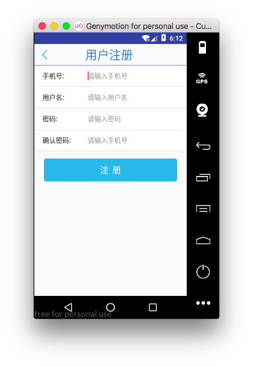

用户注册

[TOC]

# 1. activity和布局
> 布局文件

```
 layout/activity_user_register.xml
 com/example/chen/guigup2p/activity/more/UserRegisterActivity.java
```

> 效果: 

 


# 2. 界面点击事件


```java

    /**
     * 点击注册按钮事件:
     */
    @OnClick(R.id.btn_register)
    public void registerOnclick(View view) {

        //获取用户注册信息

        final String phone = etRegisterNumber.getText().toString().trim();
        final String name = etRegisterName.getText().toString().trim();

        final String pwd1 = etRegisterPwd.getText().toString().trim();
        final String pwd2 = etRegisterPwdagain.getText().toString().trim();

        //判断数据格式是否适配
        final boolean isDataRight = dataCheck(phone, name, pwd1, pwd2);

        if (isDataRight) {
            doRegister(phone,name,pwd1,pwd2);
        }


    }

Multi-line Code
```


# 3. 注册功能实现
## 1.检查数据格式
```java
    /**
     * 本地数据校验
     *
     * @param phone :必须为数字,不为空
     * @param name  : 不为空
     * @param pwd1: pwd不为空,切==pwd2
     * @param pwd2
     */
    private boolean dataCheck(String phone, String name, String pwd1, String pwd2) {
        if (TextUtils.isEmpty(phone) || TextUtils.isEmpty(name) || TextUtils.isEmpty(pwd1) || TextUtils.isEmpty(pwd2)) {
            UIUtils.toast("填写信息不能为空", false);
            return false;

        } else if (!pwd1.equals(pwd2)) {
            //判断两次密码是否一致
            UIUtils.toast("两次密码不一致", false);

            return false;
        } else {
            return true;
        }
    }
Multi-line Code
```


## 2.执行注册请求
1. 获取请求地址
2. 设置请求参数
3. 使用clien执行请求操作
    + success :请求成功 返回content
        - content==null : 可能是数据库连接错误
        - content!=null
            + content.isExist = true :存在相同的注册手机号> 当前手机号已经存在
            + content.isExist = false:注册成功 > 2s 后关闭此页面
    + failure :请求失败


```java

    /**
     * 执行注册功能
     * @param phone :手机号
     * @param name  :用户名
     * @param pwd1  :首次输入的密码
     * @param pwd2  :重复输入的密码
     */
    private void doRegister(String phone, String name, String pwd1, String pwd2) {
        //向后台发送注册请求--执行注册请求
        String url = AppNetConfig.USERREGISTER;
        RequestParams params = new RequestParams();
        params.put("phone", phone);
        params.put("name", name);
        params.put("password", pwd2);


        client.post(url, params, new AsyncHttpResponseHandler() {
            @Override
            public void onSuccess(String content) {

                if (!TextUtils.isEmpty(content)) {//若数据库未开,返回null

                    //请求成功: 1. 注册成功, 2. 注册失败
                    JSONObject jsonObject = JSON.parseObject(content);

                    boolean isExist = jsonObject.getBoolean("isExist");

                    if (isExist) {
                        UIUtils.toast("当前手机号已经存在", false);
                    } else {
                        UIUtils.toast("出册成功,两秒后关闭此页面", false);

                        UIUtils.getHandler().postDelayed(new Runnable() {
                            @Override
                            public void run() {
                                removeCurrentActivity();

                            }
                        },2000);
                    }
                } else {
                    UIUtils.toast("请求数据库失败", false);
                }
            }

            @Override
            public void onFailure(Throwable error, String content) {

                UIUtils.toast("连接服务器失败", false);
            }
        });
    }

```


