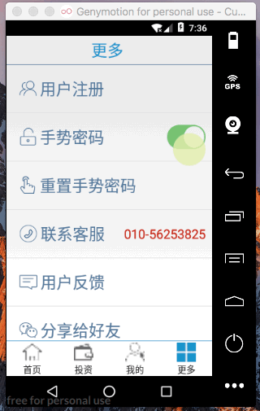

手势密码

[TOC]

# 1.手势密码状态保存

> 功能: 
当开启手势密码时,保存开启状态到sp,保证退出应用下次重新启动应用后从本地sp读取手势密码开启状态,并设置tooglebutton 的显示状态(开启/关闭)


## 1.创建sp保存手势状态
> MoreFragment : initData() 

```java

    @Override
    protected void initData(String content) {

        sp = getContext().getSharedPreferences("secrete_protect", Context.MODE_PRIVATE);
        getGestureState(sp); //获取手势状态

        //设置手势密码
        setGesture();//设置手势密码开关
        //为每个条目设置点击事件
        setItemOnclick();
    }

```


## 2.设置tooglebutton的状态改变监听

```java
 private void setGesture() {
        toggleMore.setOnCheckedChangeListener(new CompoundButton.OnCheckedChangeListener() {
            @Override
            public void onCheckedChanged(CompoundButton compoundButton, boolean isChecked) {
                if(isChecked) {
                    UIUtils.toast("开启",false);

                    sp.edit().putBoolean("isOpen",true).commit();


                }else {
                    UIUtils.toast("关闭手势密码",false);
                    //保存状态到sp
                    sp.edit().putBoolean("isOpen",false).commit();
                }
            }
        });

    }
Multi-line Code
```


## 3.读取本地sp中手势密码的状态,并更新tooglebutton 选中状态

```java
    /**
     * 获取getsture状态
     * @return
     * @param sp
     */
    public void  getGestureState(SharedPreferences sp) {

        if(this.sp !=null) {
            boolean isOpen = this.sp.getBoolean("isOpen",false);

            if(isOpen) {
                toggleMore.setChecked(true);
            }else {
                toggleMore.setChecked(false);
            }
        }
    }
Multi-line Code
```

## 4.效果

 

# 2.使用Demo改为手势密码库
## 0.导入demo
> GestureLock

## 1.复制需要用到两个activity
> demo/GestureEditActivity.java
> demo/GestureVerifyActivity.java

## 2.将Demo改为lib库
1.删除不需要的activity(将需要的activity复制到app应用中)
2.修改manifest文件     
`    <application></application>`
3. 修改build.gradle文件
> apply plugin: 'com.android.library' 

> 删除defaultConfig 中的id
 
```java
 {
 //       applicationId "com.atguigu.gesturelock"
....
}
```

# 3.绘制密码页面启动
>要求: 

- 打开密码开关(读取sp:inputCode?是否存在:)
    + 之前使用过手势密码(inputCode存在)
        * 启动手势密码: 保存sp:  设置toggleButton
        * 
    + 之前没使用过手势密码 (inputCode不存在)
        * 创建手势密码: alertDialog
            - 确定现在创建?
                + 是 : 保存sp:isOpen=true  设置toggleButton
                    * 跳转到 GestureEditActivity.java
                + 否 : 保存sp:isOpen=false 设置toggleButton
            


> 代码实现

```java
    private void setGesture() {
        toggleMore.setOnCheckedChangeListener(new CompoundButton.OnCheckedChangeListener() {
            @Override
            public void onCheckedChanged(CompoundButton compoundButton, boolean isChecked) {
                if(isChecked) {
                    UIUtils.toast("开启",false);
                    sp.edit().putBoolean("isOpen",true).commit(); //此处设置,下面可能会更改
                    toggleMore.setChecked(true);

                    //判断之前是否开启过
                    String inputCode = sp.getString("inputCode", "");
                    if(TextUtils.isEmpty(inputCode)) {//之前没设置过手势密码:
                        //启动alert 提示是否设置手势密码
                        new AlertDialog.Builder(MoreFragment.this.getContext()).setTitle("提示")
                                .setMessage("之前没有使用过手势密码,需要现在设置手势密码吗?")
                                .setPositiveButton("确定", new DialogInterface.OnClickListener() {
                                    @Override
                                    public void onClick(DialogInterface dialogInterface, int i) {
                                        //现在设定: 启动ACTIVIT
                                        BaseActivity base = (BaseActivity) MoreFragment.this.getContext();
                                        base.goToActivity(GestureEditActivity.class,null);
                                        //sp.edit().putBoolean("isOpen",true);
                                        //toggleMore.setChecked(true);
                                    }
                                })
                                .setNegativeButton("取消", new DialogInterface.OnClickListener() {
                                    @Override
                                    public void onClick(DialogInterface dialogInterface, int i) {
                                        //取消设置手势密码
                                        //1.
                                        sp.edit().putBoolean("isOpen",false).commit();

                                        toggleMore.setChecked(false);
                                    }
                                })
                                .show();
                    }else {
                        //之前设置过手势密码:开启
                        sp.edit().putBoolean("inOpen",true).commit();
                        //toggleMore.setChecked(true);
                    }


                }else {
                    UIUtils.toast("关闭手势密码",false);
                    //保存状态到sp
                    sp.edit().putBoolean("isOpen",false).commit();
                }


            }
        });

    }
```


# 4.MyFragment页面添加密码锁

> 说明: 
MyFragment页面检查用户是否登录

- 已经登录(doLoadingLocalUser)
    + 是否开启了手势密码()
        * 是:
        * 否:
- 没有登录
    + 执行登录操作(alert)

```java
    private void doLoadingLocalUser() {
        BaseActivity mainActivity = (BaseActivity) getActivity();
        User user = mainActivity.readUser();//BaseActivity 抽象方法 readUser

        //判断是否开启手势密码? 开启(输入手势密码 ):没开启(直接显示)
        SharedPreferences setcretsp = this.getContext().getSharedPreferences("secret_protect", Context.MODE_PRIVATE);
        boolean isOpen = setcretsp.getBoolean("isOpen", false);
        showUserInfo(user);

        if(isOpen) {
            BaseActivity baseActivity = (BaseActivity) this.getContext();
            baseActivity.goToActivity(GestureVerifyActivity.class,null);
            return;
        }
    }
```
