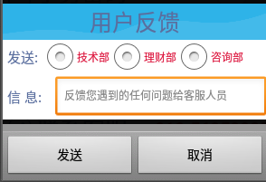

用户反馈

# 1.反馈对话框界面布局

 


# 2. 向后台发送反馈信息
```java

    /**
     * 向后台发送反馈信息
     * alertdialog
     */
    private String department = "不明确";

    private void setFeedBack() {
        View feedbackll = View.inflate(MoreFragment.this.getActivity(), R.layout.view_feedback, null);
        final RadioGroup rg_fankui  = feedbackll.findViewById(R.id.rg_fankui);
        final EditText etContent = feedbackll.findViewById(R.id.et_fankui_content);//文本框

        rg_fankui.setOnCheckedChangeListener(new RadioGroup.OnCheckedChangeListener() {
            @Override
            public void onCheckedChanged(RadioGroup radioGroup, @IdRes int checked) {
                RadioButton radioButton = rg_fankui.findViewById(checked);
                department = radioButton.getText().toString();
            }

        });

        //弹出对话框
        new AlertDialog.Builder(MoreFragment.this.getActivity())
                .setView(feedbackll)
                .setPositiveButton("发送", new DialogInterface.OnClickListener() {
                    @Override
                    public void onClick(DialogInterface dialogInterface, int i) {
                        //获取反馈信息 content + department
                        String feedBackContent = etContent.getText().toString().trim();
                        postFeedBackClien(feedBackContent, department);

                    }
                })
                .setNegativeButton("取消",null)
                .show();
    }

```

> 联网发送反馈信息

```
    /**
     * 启用异步请求,发送反馈信息
     * @param feedBackContent
     * @param department
     */
    private void postFeedBackClien(String feedBackContent, String department) {
        AsyncHttpClient client = new AsyncHttpClient();

        String url = AppNetConfig.FEEDBACK;

        RequestParams params = new RequestParams();
        params.put("department",department);
        params.put("content",feedBackContent);

        client.post(url,params,new AsyncHttpResponseHandler(){
            @Override
            public void onSuccess(String content) {
                UIUtils.toast("反馈成功!!",false);
            }

            @Override
            public void onFailure(Throwable error, String content) {
                UIUtils.toast("联网请求失败!!",false);
            }
        });
    }


```

