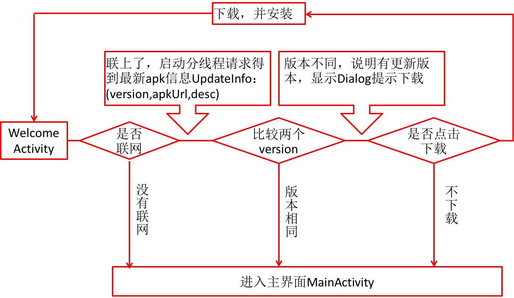

更多功能

[TOC]

# 1.联网更新

## 1. 思路

 


## 2.具体功能

### 1. 启动前检查服务器中最新版本
> 

```java
    private UpdateInfo updateInfo;

    /**
     * 请求最新apk版本
     *
     * @return
     */
    public void getLaestApkVersion() {

        final String updateUrl = AppNetConfig.UPDATE;

        AsyncHttpClient client = new AsyncHttpClient();

        client.post(updateUrl, new AsyncHttpResponseHandler() {
            @Override
            public void onSuccess(String content) {

                if (TextUtils.isEmpty(content)) {
                    UIUtils.toast("请求服务器数据异常", false);

                } else {
                    //返回content数据: {
                    //"version": "1.2",
                    //        "apkUrl":"http://192.168.1.104:8080/P2PInvest/app_new.apk",
                    //        "desc":"解决一些bug, 优化网络请求!"
                    updateInfo = JSON.parseObject(content, UpdateInfo.class);
                    handler.sendEmptyMessage(VERSION_UPDATE_INFO);

                }
            }
            @Override
            public void onFailure(Throwable error, String content) {
                UIUtils.toast("请求服务器数据失败", false);
            }
        });
    }

```


### 2. 获取本地版本号

```java

    /**
     * 当前版本号
     *
     * @return
     */
    private String getVersion() {
        String version = "0";
        PackageManager manager = getPackageManager();
        try {
            PackageInfo packageInfo = manager.getPackageInfo(getPackageName(), 0);
            version = packageInfo.versionName;
        } catch (PackageManager.NameNotFoundException e) {
            //e.printStackTrace(); //如果找不到对应的应用包信息, 就返回"未知版本"
        }
        return version;
    }
```


### 3. 比较版本号确定是否需要更新

```java
    /**
     * 比较版本
     *
     * @param updateInfo
     * @param localVersion
     */
    private void compareApkVersion(UpdateInfo updateInfo, String localVersion) {
        //1. 获取当前版本


        float currentVersion = Float.parseFloat(getVersion());
        float updateVersion = Float.parseFloat(updateInfo.version);

        if (currentVersion < updateVersion) {
            handler.sendEmptyMessage(VERSION_ALERT_DIALOG);
        } else {
            UIUtils.toast("当前版本为最新版本", false);
            // handler.sendEmptyMessage(TO_MAIN);
            toMain(0);//不需要版本更新时,跳转
        }


    }
Multi-line Code
```


### 4. 更新下载应用
> 流程

- 1. 初始化apkfile 位置
- 2. dialog
- 3. 启动分线程下载文件

```java

    /**
     * 从服务器下载apk
     * 1. 显示下载进度-主线程
     * 2. 启动下载任务-分线程
     */
    private ProgressDialog dialog;

    private void downloadApkFile() {

        //初始化水平进度条的dialog
        dialog = new ProgressDialog(this);
        dialog.setProgressStyle(ProgressDialog.STYLE_HORIZONTAL);
        dialog.setCancelable(false);
        dialog.show();
        //初始化apk 存放位置
        File fileDir;
        if (Environment.getExternalStorageState().equals(Environment.MEDIA_MOUNTED)) {
            fileDir = this.getExternalFilesDir("");//sd卡存储路径:
        } else {
            fileDir = this.getFilesDir();//获取手机存储路径/storage/emulated/0/Android/data/com.example.chen.guigup2p/files
        }

        apkFile = new File(fileDir,"apkFile.apk");
        //3. 启动分线程下载

        new Thread(){
            @Override
            public void run() {


                String path = updateInfo.apkUrl;
                URL url = null;

                HttpURLConnection conn=null;
                InputStream in = null;
                FileOutputStream out = null;

                try {
                    url = new URL(path);
                    conn = (HttpURLConnection) url.openConnection();

                    conn.setRequestMethod("GET");
                    conn.setConnectTimeout(5000);
                    conn.setReadTimeout(5000);

                    conn.connect();


                    if(conn.getResponseCode()==200) {

                        int contentLength = conn.getContentLength();
                        dialog.setMax(contentLength);//设置dialog最大值

                        in = conn.getInputStream();

                        out = new FileOutputStream(apkFile);


                        byte[] buffer = new byte[1024];
                        int len;
                        while ((len=in.read(buffer))!=-1){
                            dialog.incrementProgressBy(len);//进度条增加
                            out.write(buffer,0,len);
                            SystemClock.sleep(1);
                        }

                        //下载完成
                        handler.sendEmptyMessage(APK_DOWNLOAD_SUCCESS);
                    }else {
                        handler.sendEmptyMessage(APK_DOWNLOAD_FAIL);

                    }
                } catch (IOException e) {
                    e.printStackTrace();
                }finally {
                    if(conn != null) {
                        conn.disconnect();
                    }

                    if(in!=null) {
                        try {
                            in.close();
                        } catch (IOException e) {
                            e.printStackTrace();
                        }
                    }
                    if(out!=null) {
                        try {
                            out.close();
                        } catch (IOException e) {
                            e.printStackTrace();
                        }
                    }
                }
            }

        }.start();
    }

```


### 5. 安装应用
> 根据 targetSdkVersion是否>23 做相应处理

```java
    /**
     * 开始安装apk
     */
    private void installApk() {
        //        targetSdkVersion 23 及其以下
        Intent intent = new Intent("android.intent.action.INSTALL_PACKAGE");
        intent.setData(Uri.parse("file:" + apkFile.getAbsolutePath()));
        startActivity(intent);

/*      android 7.0 以上版本 需要 使用provider 访问隐私目录
        Intent i=new Intent(Intent.ACTION_VIEW, FileProvider.getUriForFile(this,));

        i.addFlags(Intent.FLAG_GRANT_READ_URI_PERMISSION);
        startActivity(i);
*/
    }
Multi-line Code
```


