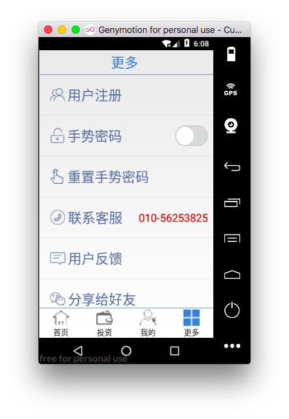

[TOC]

 尚硅谷P2P金融项目

## 1.HomeFragment


### [1.软件框架](markdown_note/readme_01.md)
### [2.未捕获异常处理](markdown_note/readme_02.md)

### [3.HomeFragment页面](markdown_note/readme_03.md)
### [4.欢迎界面效果](markdown_note/readme_04.md)
### [5.圆形进度条](markdown_note/readme_05.md)
### [6.自定义scrollview](markdown_note/readme_06.md)


## 2.InvestFragment


### [7.抽取BaseFragment](markdown_note/readme_07.md)
### [8.LoadingPage](markdown_note/readme_08.md)
### [9.投资:理财产品](markdown_note/readme_09.md)
### [10.投资:推荐理财](markdown_note/readme_10.md)
### [11.投资:热门理财](markdown_note/readme_11.md)

## 3.MyFragment

### [12.我的资产](markdown_note/readme_12.md)
### [13.修改用户头像](markdown_note/readme_13.md)
### [14.支付功能](markdown_note/readme_14.md)
### [15.图表绘制](markdown_note/readme_15.md)

## 4.MoreFragment
### MoreFragment界面初始化

> MoreFragment 界面布局

 


> 点击按钮,分别跳转到相应子功能界面activity

```java
    @Override
    protected void initData(String content) {

        //为每个条目设置点击事件
        tvMoreRegist.setOnClickListener(this);

        tvMoreReset.setOnClickListener(this);

        rlMoreContact.setOnClickListener(this);
        tvMoreFankui.setOnClickListener(this);
        tvMoreShare.setOnClickListener(this);

        tvMoreAbout.setOnClickListener(this);

    }
Multi-line Code
```

```java
    @Override
    public void onClick(View view) {
        switch (view.getId()){
            case R.id.tv_more_regist :
                Log.d("MoreFragment", "用户注册");
                BaseActivity baseActivity = (BaseActivity) this.getActivity();
                baseActivity.goToActivity(UserRegisterActivity.class,null);
                break;
            case R.id.tv_more_reset:
                Log.d("MoreFragment", "重置密码");
                break;
            case R.id.tv_more_about:
                Log.d("MoreFragment", "关于");
                break;
            case R.id.rl_more_contact:
                Log.d("MoreFragment", "客服");
                break;
            case R.id.tv_more_fankui:
                Log.d("MoreFragment", "反馈");
                break;
            case R.id.tv_more_share:
                Log.d("MoreFragment", "分享");
                break;
        }
    }
Multi-line Code
```

### [16.用户注册](markdown_note/readme_16.md)


